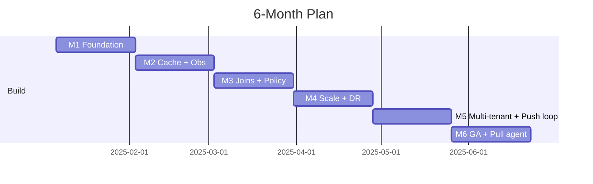

# Plan of Action — Universal SQL Layer

Six months from where we are to a product people use every day. The POC
([`README.md`](./README.md)) proved the load-bearing pieces — connector
contract, plan-time entitlements, parallel federated joins, freshness
cache, audit. This plan turns that into a product.

---

## The product we're building

> A universal data access layer that exposes every SaaS tool a company
> uses as one queryable, permission-aware surface — answered in plain
> English, kept live by webhooks, and watched by an agent while you sleep.

Three shifts from POC to product:

1. **Connectors for everything.** Two real today (GitHub, Jira). Ten by
   month six (Salesforce, Slack, Notion, Linear, Stripe, ServiceNow,
   Datadog, AWS, Zendesk, HubSpot). Same six-file recipe each time.
2. **English instead of SQL.** An NL→SQL agent on top of the JSON
   schema catalog. Anyone — sales, finance, on-call — asks a question,
   gets a permission-checked answer.
3. **Push instead of poll.** Webhook ingestion invalidates caches the
   instant data changes. Subscriptions stream updates. Rule-watcher
   agent pings you in Slack before you'd have noticed.

That's the product. Everything below is how engineers ship it.

---

## Two loops, both agentic

The product is two loops bolted to the same substrate. The substrate
(catalog, planner, entitlements, executor, audit) is the POC. The loops
are the work.

### Pull loop — the user (or their agent) asks
```
   English question
        ↓
   [Planner agent · Sonnet]    reads /v1/connectors catalog, drafts SQL
        ↓
   [Critic agent · Opus]       checks columns exist, RLS won't strip the
                                answer, pushdown is used; rewrites if not
        ↓
   plan-time entitlements  →  rate limit  →  parallel fan-out  →  rows
        ↓
   [Recommender · Sonnet]      "people who ran this also looked at X;
                                want me to set up a watch for Y?"
        ↓
   answer + 1–3 suggested next queries + optional saved watch
```

Every LLM call is logged with a `trace_id`, the catalog it saw, and the
plan it produced — same audit shape as a human-issued query. Reproducible,
attributable, replayable.

### Push loop — events arrive, the system reacts
```
   Webhook from GitHub / Jira / Stripe / ...
        ↓
   [Connector verify + normalize]    HMAC, dedupe by delivery_id
        ↓
   Event bus  →  invalidation index  →  refresh affected SSE subscribers
        ↓
   [Rule-watcher agent · Sonnet]     evaluates user-defined English rules
                                      against the new state
        ↓
   if a rule fires:
     [Summarizer · Opus]  drafts Slack/email: what changed, why it matters,
                          1 suggested action + a deep link to the trace
```

A user never writes alert SQL. They write a sentence ("ping me when MRR
drops > 3% in 24h") and the rule-watcher compiles it once to a
plan-fragment + threshold; the push loop runs that fragment against
every relevant event from then on. Cheap, deterministic, auditable.

### What runs each agent

| Step | Model | Latency budget | Why this model |
|---|---|---|---|
| NL→SQL planner | Sonnet (with cache) | 300–500ms | Cheap, good at structured generation against a JSON catalog |
| SQL critic | Opus | 600–900ms | One careful pass beats five cheap ones; catches semantic errors |
| Recommender | Sonnet | 200–400ms | Embedding-search + light reasoning on saved-query history |
| Rule compiler | Opus (once per rule) | offline | Compiles English → plan fragment + threshold; cached |
| Rule-watcher | deterministic eval | <10ms | No LLM on the hot path — the fragment is already compiled |
| Alert summarizer | Opus | 1–2s (off-path) | Only on fire; quality matters more than latency |

The hot push path **never calls an LLM** — that would make alerts both
slow and non-deterministic. LLMs compile rules and write summaries;
deterministic plan fragments do the watching.

---

## What's in the POC vs. what's left

| Done | Left to build |
|---|---|
| Connector contract (5 sources, 0 hot-path edits) | OAuth + token refresh per source |
| Plan-time RLS/CLS, holds across JOIN | OPA/Rego, source-scope ∩ tenant-policy |
| Per-connector rate limit + async overflow | Redis-backed buckets |
| Parallel fan-out, partial-on-timeout | Circuit breaker, single-flight |
| TTL cache + ETag + stale-if-error | L2 Redis cache, per-tenant KMS |
| Cross-app join across two real APIs | DuckDB+S3 spill for large joins |
| Tenant-scoped cache keys (no bleed) | Postgres tenant registry, schema drift |
| Audit + trace for every access | Audit → S3 WORM, per-tenant export |
| Connector versioning in API + audit | OIDC/JWKS (today: HS256 dev JWT) |
| 27 tests, ~586 req/s on a laptop | 1k QPS sustained, multi-region DR |

The right column is the work.

---

## Six milestones, four weeks each



Each milestone ends in a working deliverable. No big-bang integration.

---

### M1 — Foundation (weeks 1–4)
**Product:** real GitHub + Jira against a real tenant, with real auth.

- OIDC/JWKS replaces the dev JWT.
- OPA sidecar wired up with a default allow/deny policy.
- Redis Lua-CAS rate limiter; the in-process backend stays for unit tests.
- Postgres tenant registry + schema catalog.
- Connector SDK v0: pagination, OAuth refresh hook, error taxonomy.
- Migrate the 5 POC connectors to the SDK.

**Exit:** real-GitHub query works for a staging tenant with a rotated
OIDC token. Two gateway replicas share the same rate-limit bucket
(proves state is out of process).

---

### M2 — Cache + Observability (weeks 5–8)
**Product:** dashboards that don't lie. P95 < 1.8s on single-source.

- Pushdown matrix per connector; planner consults it.
- Redis L2 cache, KMS-wrapped DEKs per tenant.
- Single-flight revalidation under concurrent miss.
- ETag/304 in the SDK, live against GitHub.
- Schema-drift reconciler with `SCHEMA_DRIFT` error + alert.
- Circuit breakers, 3-state.
- Grafana dashboards-as-code, SLO doc, error-budget policy.
- k6 in CI on mocks, weekly synthetic against staging real APIs.

**Exit:** P95 < 1.8s on real GitHub at 200 QPS for 10 min. Cache hit
ratio > 50% on a replayed workload. Kill one source mid-query →
`partial:true`, the other still returns.

---

### M3 — Joins + Policy + Async (weeks 9–12)
**Product:** the cross-app federated join, in production. Async path
ready for long-running and scheduled work.

- Cardinality estimator picks the build side and the spill threshold.
- DuckDB + S3 short-lived materialization (≤10 min TTL).
- Join-key type coercion (int ↔ string is the common case).
- RLS/CLS in Rego, **pre-compiled to plan fragments** at load time —
  same compile output the rule-watcher will reuse in M5.
- Entitlement service = source-scope ∩ tenant-policy.
- **Async path, properly built:** Postgres `jobs` table + worker pool
  + `/v1/jobs/{id}`. Three job kinds from day one — *overflow* (rate-limit
  reroute), *scheduled* (saved query on a cron), *long-running* (joins
  that spill). One workers process, three reasons to enqueue.
- **Event bus skeleton:** NATS JetStream (or Redis Streams; revisit M4)
  for connector-emitted events. Workers and the future webhook ingestor
  publish here; subscribers consume by tenant + connector.
- Full error vocabulary shipped.

**Exit:** `eng`-role join across GitHub↔Jira returns zero OPS rows
even when keys would match. Async reroute completes in 60s under
200 QPS. 50k-row join spills to DuckDB and matches the in-memory
result on a sample. A scheduled query (cron) lands rows in the audit
log under the job's owner.

---

### M4 — Scale + DR (weeks 13–16)
**Product:** 1k QPS, automated infra, basic disaster recovery.

- HPA on CPU + queue depth; pre-warmed pool for spikes.
- Terraform end-to-end: clean account → working env in ≤20 min.
- Argo Rollouts canary, auto-rollback on SLO breach.
- Multi-AZ Postgres, Redis cluster mode, AZ-spread gateways.
- DR: Postgres PITR, Redis snapshot to S3 every 15 min, restore drill
  in a separate account.
- 1k QPS k6 scenario: ramp, soak, spike.
- Profile and optimize whatever the load test exposes.

**Exit:** 1k QPS for 60 min, P95 < 1.5s, error rate < 0.1%, no manual
touches. Canary auto-rolls back on injected 5xx > 1%. DR restore in 4h.

---

### M5 — Multi-tenant + Cost + Push loop (weeks 17–20)
**Product:** safe for paying customers. **Push loop lights up.**

Multi-tenant hardening:
- NetworkPolicy audit + drift detection in CI.
- Cross-tenant red-team test in CI (Tenant A can't read Tenant B's anything).
- Audit log → S3 WORM with per-tenant export endpoint.
- Per-tenant cost attribution + soft alerts at 80%, hard throttle at 100%.
- Data-residency tags enforced at pod selection.
- Off-board workflow: revoke OAuth, TTL→0, KMS scheduled-delete, audit archival.
- Targeted perf pass (cache-key compute, OPA eval, predicate ser/de).

Push loop (built on the M3 event bus):
- **Webhook ingestion** for GitHub + Jira + Stripe — HMAC verify per
  connector, idempotent by `delivery_id`, dead-letter for malformed.
- **Row-level invalidation index** — reverse map from `{connector, table,
  row_pk}` → cache keys. Cache writes update the index; events tear down
  the right keys with no blast radius.
- **SSE subscriptions** — `POST /v1/subscribe` returns a stream id;
  clients receive diffs when relevant data changes. Re-checks RLS/CLS
  on every push (entitlements at push time, not just plan time).
- **Single-flight on refresh** — N subscribers to the same query → one
  upstream fetch, fan-out to all.

**Exit:** red-team CI test passes. Cost attribution within 10% of
measured spend. P95 improves ≥15% vs. M4. End-to-end push: a GitHub PR
opened in staging triggers a subscriber's SSE event in < 1 s, with
RLS-correct payload.

---

### M6 — GA + Pull agent + Cockpit alpha (weeks 21–24)
**Product:** GA-ready, with English-in / answer-out, and a rule-watcher
running for an alpha cohort.

GA gates:
- Run all 8 chaos drills from [`design_doc.md §17`](./design_doc.md#17-chaos-engineering-plan).
  AI drafts runbooks from findings; SRE edits and merges.
- External STRIDE review + third-party pen test.
- Onboarding playbook: a DX engineer adds Salesforce in <2h (acceptance test).
- SLO + burn-rate alerts that block deploys on budget exhaustion.

Pull loop (agentic), wired against the M5 push loop:
- **MCP server** — `/v1/connectors` + `/v1/query` exposed as MCP tools so
  Claude / Cursor / any MCP client can use the product directly.
  Entitlements still apply.
- **NL→SQL planner agent** (Sonnet) — reads the catalog, drafts SQL,
  emits the `plan` JSON the executor already accepts.
- **SQL critic agent** (Opus) — second pass: nonexistent columns,
  un-pushable predicates, "this query will be 95% RLS-stripped — ask for
  what you actually want." Rejects or rewrites.
- **Recommender** (Sonnet) — every answer returns 1–3 *related* queries
  drawn from the tenant's saved-query history + embedding similarity.
  "Want me to save this as a watch?" → one click registers a rule.
- **Rule-watcher in production** — English rules compiled by Opus to
  plan fragments, evaluated by the push loop. Slack/email alerts with
  Opus-drafted summaries on fire.

**Exit:** 8 chaos drills pass. No critical security findings. Salesforce
onboarded in <2h by someone new. 1k QPS green 7 days running. NL→SQL
accuracy on a 50-question benchmark: ≥85% executable, ≥95% no
entitlement bypasses (the critic must catch the rest). 3 alpha
customers using the cockpit daily.

---

## Team

Eight people. Lean on purpose.

| Role | # | Owns |
|---|---|---|
| EM | 1 | Tech lead M1–M2; people lead M3+ |
| Backend | 3 | Gateway/planner · Connectors · Async + ops |
| Infra | 1 | IaC, Helm, CD, observability stack |
| Security | 1 | Threat model, Vault/KMS, pen-test prep |
| QA | 1 | Test harness, load, chaos |
| PM / DX | 0.5 + 0.5 | Roadmap · SDK docs, connector playbook |

AI-assisted work across the team (~30% throughput uplift) is how 8 FTE
carry a ~10–11 FTE scope. We spend the surplus on scope, not headcount,
because M3–M6 is gated by security and chaos review (humans must
approve) not by raw code.

---

## How AI shows up in the dev loop

Specific, measurable, no magic.

- **`add-connector` skill** — mock connector in <2h, real REST connector
  in ~1 day (vs. ~3).
- **Test generation from `ConnectorManifest`** — contract tests
  synthesized from tables × pushable filters × error modes.
- **Schema-drift triage** — on drift, AI summarises the diff, lists
  impacted saved queries from the audit log, proposes a migration.
- **PR security gate** — every PR gets a checklist comment before human
  review: does it touch the hot path? does it move RLS injection? does
  it pull in a CVE'd dep?
- **Runbook drafts** — after each chaos drill, AI drafts from incident
  notes + telemetry; SRE edits and merges.
- **Cost critique on plans** — `/v1/explain` output → LLM critique:
  *"this query will hit GitHub search rate limit at 12 req/s — push
  the `repo:` filter."*
- **Rego authoring** — human writes the intent, AI compiles to Rego,
  reviewer checks the resulting plan fragment.

**What AI does not do:** production deploys, security sign-off, incident
command, PII review, autonomous policy changes. All human-gated.

---

## Applied AI in the product

The dev-loop section above is how engineers ship. This section is what
the user actually feels.

### Pull side — agents that turn intent into answers

- **NL→SQL planner (Sonnet).** Reads the catalog over MCP, drafts the
  `plan` JSON. Cached prompts: the catalog and the user's saved-query
  history are stable, so we hit Anthropic prompt-cache on most calls.
  Median cost per query: a fraction of a cent.
- **SQL critic (Opus).** One careful pass. Rejects nonexistent columns,
  catches predicates that won't push down, flags "this will be entirely
  RLS-stripped for this user." If it can fix, it rewrites; if not, it
  returns a structured error the planner can retry against.
- **Schema discovery hint.** When the catalog grows past ~50 tables,
  the planner asks an embedding index *"which 5 tables are relevant to
  this question?"* before reading the full schemas. Keeps context small,
  keeps planning fast.
- **Recommender.** After every answer, returns 1–3 next-best queries.
  Sources: (a) what *this user* has run before, (b) what others in this
  tenant ran after similar queries, (c) embedding similarity over saved
  queries. Surfaces as chips: *"Want PRs idle > 24h with open Jira
  blockers? • Want this grouped by team?"*
- **Save-as-watch.** Any query becomes a rule with one click — "alert
  me when this returns rows / when the count changes by N%."

### Push side — agents that watch and explain

- **Rule compiler (Opus, one-shot).** English rule → plan fragment +
  threshold + cadence. Compiled once at save time, then deterministic.
  No LLM on the hot push path.
- **Anomaly explainer (Opus, on fire).** When a rule fires, Opus takes
  the rows, the rule, the recent history from audit, and drafts a
  Slack message: *what changed, why it likely matters, one suggested
  action, deep link to the trace.* The user sees the explanation, not
  the SQL.
- **Cross-source correlation.** "MRR dropped 4%" + "Zendesk P1 volume
  doubled 24h ago" → recommender suggests the rule that joins them.
  The system learns the patterns that matter for *this* tenant by
  watching which suggested rules get saved.

### Recommendation engine, in one paragraph

Everything the user does (query, save, ack alert, dismiss suggestion)
is an event in the audit log already. A nightly batch job builds two
indexes: an embedding index over query text + result schema, and a
co-occurrence index ("after running X, users in this tenant often run
Y"). At query time, the recommender consults both, ranks, and returns
the top 3. No model training, no MLOps — it's classic retrieval + a
small LLM rerank. Tractable in M6.

### Guardrails — LLMs respect the same boundaries as humans

- **The critic cannot bypass entitlements.** The plan it emits still
  goes through plan-time RLS/CLS. An LLM cannot grant itself access it
  didn't have via clever rewriting.
- **Every LLM call is audited** with model id, prompt hash, output, and
  the trace_id of the resulting query. Reproducible after the fact.
- **No PII in prompts.** The planner sees schema, not rows. The
  summarizer sees rows the user is already entitled to see, and only
  for the rule that fired.
- **Customer opt-out** at the tenant level: NL→SQL and summaries can
  be disabled per-tenant; everything else (deterministic planner +
  push loop) works without LLMs at all. The product degrades to "very
  fast English-free Looker" — still useful.

---

## Continuous workstreams

Run alongside the milestones, owned by their leads.

- **Connector pipeline** (DX) — Q1: GitHub + Jira live (done). Q2:
  Salesforce, Notion, Slack. Q3+: ServiceNow, Datadog, AWS, Stripe,
  Zendesk, HubSpot.
- **Security & compliance** (Security) — STRIDE every milestone; SOC2
  inventory in M5, evidence in M6; GDPR DSR tooling M5–M6.
- **Observability** (Infra + Backend) — per-tenant dashboards in-app,
  metric→trace exemplars, cardinality budget, cost-attribution view.
- **Developer experience** (DX) — JDBC/ODBC shim, dbt adapter, Python
  client, VS Code extension with catalog autocomplete, `/v1/explain`.
- **Cost / FinOps** (joins M3) — hit-ratio tuning, pushdown coverage,
  budget caps in M5, spot async workers, source tiering.
- **IaC platform** (Infra) — M2 dashboards-as-code → M3 secrets/policy
  bundles → M4 full Terraform → M5 SOC2-aligned change management →
  M6 blue/green DR drill.
- **Applied AI** (Backend + DX, joins M4) — M4: embedding index over
  catalog + saved queries. M5: rule compiler (English → plan fragment),
  Slack summarizer prototype on staging. M6: NL→SQL planner + critic
  + recommender behind a per-tenant feature flag. Eval harness
  (50-question accuracy benchmark, entitlement-bypass red team) is in
  CI from M4 onward.

---

## Decisions we'll revisit

Bet now, switch if the data says so.

| Decide at | What | Switch when |
|---|---|---|
| End of M2 | L2 cache: LRU vs W-TinyLFU | Hit ratio < 50% |
| End of M3 | Event bus: NATS vs Redis Streams | Throughput > 50k events/s or ordering bugs |
| End of M3 | Async store: Postgres vs SQS | Postgres write QPS > 500 |
| End of M4 | OPA: sidecar vs embedded | OPA eval p95 > 50ms |
| End of M5 | NL→SQL: single-pass vs planner+critic | Single-pass accuracy ≥ 90% on benchmark |
| Start of M5 | SDK: Python vs polyglot | Customer asks for Go/Java |
| Start of M6 | JDBC driver: build vs partner | BI tools > 30% of customers |
| Post-GA | Federation engine: home-grown vs Trino | Multi-JOIN is the bottleneck |

---

## Risks we're tracking

| Risk | L | I | Mitigation |
|---|---|---|---|
| Connector API drift | H | M | SDK error taxonomy, drift alerts, AI migration drafts |
| GitHub quota at scale | H | H | Per-tenant token pooling, async overflow, mocks in CI |
| Schema drift breaks queries | M | H | Reconciler, `SCHEMA_DRIFT` graceful error, AI fix-up |
| OPA eval latency | M | M | Pre-compile policies, CI bench |
| DuckDB S3 spill latency | M | M | Week-9 benchmark; in-memory fallback if S3 > 2s/MB |
| Cluster cost overrun | L | M | TF cost estimation in PRs, monthly alerts |
| OAuth rotation downtime | L | H | Vault dynamic secrets, zero-downtime rotation |
| NL→SQL hallucination / entitlement bypass | M | H | Critic pass + plan-time RLS catches; 50Q eval + red team in CI; per-tenant opt-out |
| Webhook storm or replay attack | M | M | Idempotent by `delivery_id`, HMAC verify, per-connector rate limit on ingest, DLQ |
| Push loop fan-out cost | M | M | Single-flight refresh, subscription cap per tenant, sample-then-fan-out on heavy events |
| LLM provider outage | L | M | Degrade to template-based suggestions; planner falls back to "give me SQL" mode; nothing on the hot push path |

---

## After GA (months 7–18)

What we deliberately defer because it would compromise GA quality —
all motivated by customer signal or POC-revealed limits, none speculative.

- **Q3 — SQL expansion.** Multi-JOIN with cost-based ordering, OR
  predicates, date arithmetic, aggregates + GROUP BY, CTEs, `EXPLAIN` GA.
- **Q3–4 — Multi-region active-active.** Cell-based, catalog replicated
  globally, data plane regional. Non-blocking pieces can start in M4.
- **Q3–4 — Cockpit β — widen the push loop.** Webhooks for every
  connector that has them (Slack, Linear, Salesforce, Stripe, Zendesk).
  CDC for sources without webhooks. Polling fallback for the rest. Goal:
  median freshness < 2 s across the catalog.
- **Q4 — Cockpit GA — proactive recommendations.** Move the recommender
  from "after a query" to "all the time" — a tenant-scoped agent watches
  the firehose and proposes rules ("you've manually checked open KAFKA
  blockers 14 times this week; want a daily digest?"). Embedding search
  over text fields (PR titles, ticket descriptions) joinable with
  structured columns.
- **Q5 — Write path.** `UPDATE jira.issues SET status=…` translates to
  API calls. Separate write OPA policy, idempotency on every mutation,
  saga for cross-source. A quarter of work + a new threat model. Unlocks
  *acting* on recommendations, not just reading them.
- **Q5–6 — Agent-to-agent.** Outside agents (Cursor, Claude Desktop,
  internal workflow bots) call us via MCP; we call back via webhooks.
  The product becomes the data spine of a customer's agent stack.
- **Q6+ — Performance R&D.** Vectorized executor (Arrow + Polars),
  optional Rust sidecar for highest-QPS connectors, bloom-filter
  pushdown, adaptive execution.

---

## Lessons from the POC — treat as plan invariants

1. **The connector contract is the load-bearing abstraction.** Five
   sources added with zero hot-path edits. Every milestone's exit
   criteria includes "no hot-path changes to add a new connector."
2. **Entitlements at plan time, never after fetch.** RLS predicates
   appear in the logged plan *before* any connector call. M3's Rego
   compile-to-plan is the same principle, scaled.
3. **`partial:true` is a feature, not an error.** Every chaos drill
   includes "kill one source, assert partial + other source's rows."
4. **Mocks and live connectors coexist forever.** Mocks are the only
   way to load-test without quota, the only way unit tests stay fast,
   the only way demos are deterministic.
5. **Cross-cutting IDs match their tools' formats.** The POC's 16-char
   `trace_id` vs. Jaeger's 32-char cost 30 minutes of debugging. Every
   trace / job / audit ID uses the format of the tool that indexes it.

---

## Done means

- All M1–M6 exits met.
- 8 chaos drills pass, runbooks merged.
- External pen test: no critical, ≤2 high.
- A third real connector (Salesforce) onboarded by the playbook in <2h.
- 1k QPS staging green 60 min × 7 days running.
- SOC2 Type II controls inventoried, evidence collection underway.
- GA runbook signed off by EM + Security + SRE.
- Post-GA roadmap published so customers can plan against it.
- **Push loop in prod:** event → SSE subscriber update in < 1 s on a
  released connector (GitHub or Jira).
- **Pull agent in prod:** NL→SQL ≥ 85% executable, ≥ 95% no entitlement
  bypasses on the eval set; recommender returning suggestions on every
  query for the alpha cohort.
- Cockpit alpha live for 3 friendly customers, with at least one English
  rule firing in Slack per customer per week.
