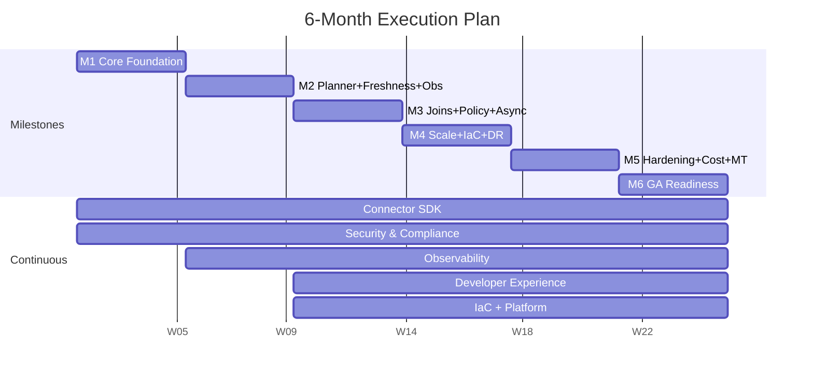

# Plan of Action — Universal SQL Layer (6-month execution plan)

Operational roadmap from prototype → GA. Each milestone ends in a working
deliverable; no big-bang integration.

- Architecture, STRIDE threat model, cost levers, chaos plan:
  [`design_doc.md`](./design_doc.md)
- Running prototype + reproducible demos: [`README.md`](./README.md)

## What's proven vs what's deferred

| Proven by working code | Deferred (in-process stand-in today) |
|---|---|
| Connector contract (5 sources, zero hot-path edits) | OAuth flow + token refresh per source |
| Plan-time RLS/CLS injection, holds across JOIN | OPA / Rego policy DSL + source-permission ∩ tenant-policy |
| Per-source rate limit, atomic across connectors, async overflow | Redis-backed buckets (today: in-process dict) |
| Parallel fan-out + partial results on timeout | Circuit breaker + single-flight revalidation |
| TTL cache + ETag (mock) + stale-if-error + per-query staleness | L2 Redis cache + per-tenant KMS-wrapped DEKs |
| Cross-app SQL join across two real REST APIs | DuckDB+S3 materialization for joins above memory |
| Tenant-scoped cache keys (no cross-tenant bleed, verified) | Postgres tenant registry + schema catalog + drift reconciler |
| Audit trail of every access (including denials) | Audit log → S3 WORM, per-tenant export |
| Connector versioning (semver in manifest, exposed in API + audit) | HS256 dev JWT → real OIDC/JWKS |
| 27 tests, k6 load script (~586 req/s captured) | 1k QPS sustained on real infra; multi-region DR |

The right column is the load-bearing scope for M1–M6.

## Timeline

## Team

| Role | Count | Lead focus |
|---|---|---|
| EM | 1 | Tech lead M1–M2; people lead M3+ |
| Backend Engineers | 3 | Gateway/planner · Connectors · Infra-adjacent ops |
| Infrastructure Engineer | 1 | IaC, Helm, CD, observability stack |
| Security Engineer | 1 | Threat model, Vault/KMS, pen-test prep |
| QA Engineer | 1 | Test harness, load, chaos |
| PM | 0.5 | Shared |
| DX | 0.5 | SDK docs, connector onboarding playbook |

**~8 FTE total.** AI-assisted execution (next section) lets this team carry the
scope of an unassisted ~10–11 FTE team.

## How AI / Claude assistance shapes the plan

The plan assumes ~30% of engineering throughput comes from AI-assisted work
across the team's IDE, CI, and on-call workflows. This is *specific* — each
use below has a measurable expected effect on milestones.

### Concrete uses in the dev loop (M1–M6)

| Use | Where in the plan | Expected impact |
|---|---|---|
| **Connector onboarding via the bundled `add-connector` skill** | Continuous (Connector SDK workstream) | Time-to-PR for a new mock connector: <2h. For a real REST connector with OAuth + pagination + smoke test: ~1 day instead of ~3 |
| **Test generation from manifests** | M1.10, M2.8, M3.9 | Contract tests synthesized from `ConnectorManifest` (tables × pushable_filters × error modes); k6 scenarios from SLO doc |
| **Schema-drift triage** | M2.5 reconciler | On detected drift, AI summarises the diff, lists impacted saved queries (from audit), and proposes a migration; SRE/Backend approves |
| **PR security gate** | Continuous Security workstream | Each PR: AI runs a checklist — does it touch a hot-path file? does it move RLS injection earlier or later? does it add a dependency with known CVEs? — and posts a structured comment before human review |
| **Runbook generation** | M6.5 | After each chaos drill (M6.1), AI drafts the runbook from incident notes + telemetry; SRE edits and merges |
| **Design doc + plan-of-action sync** | Continuous | When a PR changes an architectural decision, AI proposes the design doc / PLAN_OF_ACTION diff so they don't drift from code |
| **Cost critique on query plans** | M5.4 cost model | The `/v1/explain` plan output is passed to an LLM for cost critique: "this query will hit GitHub search rate limit at 12 req/s — consider pushing `repo:` filter" |
| **OPA Rego policy authoring** | M3.4 | Human writes the intent; AI translates to Rego; reviewer checks the compiled plan fragment shape |

### Concrete uses in the product (post-GA — but the substrate lands earlier)

Universal SQL is a natural AI backplane: the catalog is JSON-discoverable, the
entitlement model enforces least-privilege at plan time, and the response
shape includes structured errors. The post-GA AI features in Q5 are quick to
ship because the substrate already exists.

- **MCP server** — `/v1/connectors` and `/v1/query` exposed as MCP tools.
  Agents discover tables and query them safely (entitlements still apply).
  ~1 week because schema catalog is already JSON.
- **NL → SQL with two-pass critique** — Claude Sonnet translates intent to
  SQL; Claude Opus critiques the SQL against the catalog before submission
  (rejects nonexistent columns, suggests valid alternatives). Saves customers
  ~half their schema-discovery time.
- **Agent-friendly error envelope** — every error already carries a structured
  `message`. We extend it with `suggested_action`. E.g. `INVALID_SQL` on
  `github.commits` returns `"table not found — did you mean github.pull_requests?"`.
- **Embedding search** over PR titles + issue descriptions, joinable with
  structured fields. Backed by a separate vector index.

### Velocity & scope reallocation

With AI in the loop, the 8-FTE team's throughput is closer to 10–11 FTE
unassisted. We **spend that surplus on scope, not headcount** — because the
gating constraints in M3–M6 are security review, multi-tenant hardening, and
chaos validation (where AI assists but humans must approve), not raw code.

Concretely:
- **Promote multi-JOIN** (originally Q3 post-GA) into **M5** if customer
  signal in M3–M4 confirms.
- **Promote the MCP server prototype** into **M6 stretch**, ready for an
  alpha cohort the day after GA.
- **Backstop M2.5 schema-drift reconciler** with AI-suggested migrations so
  the M2 exit gate isn't blocked on Backend bandwidth.

### What AI does NOT do

To keep the threat model honest:

- **No production deploys without human approval.** AI can draft Helm/Terraform
  diffs; humans approve every prod change.
- **No security sign-off.** M6's STRIDE update and external pen test are human-led.
- **No incident command.** AI assists with `grep`, log correlation, and runbook
  retrieval during outages; humans run the incident and own the comms.
- **No PII/customer-data review.** Audit-log exports go through an SRE+Legal
  human review; AI never sees raw customer rows.
- **No autonomous policy changes.** Rego policy proposals go through the same
  Git-bundle review path; AI just drafts.

## Pre-M1 — Week 0

Four days; skipping it makes M1 slip.

- Hire confirms, NDAs, repo access (EM).
- Cloud account + IAM baseline + SCP region restriction (Infra).
- Postgres (single-AZ dev tier) for tenant registry + schema catalog (Infra).
- Vault dev mode + AppRole template (Security).
- OPA sidecar vs library — RFC merged (Backend).
- OIDC IdP picked + wired to stub app (Security).
- OTel collector → staging Tempo (Infra).
- Connector contract-test harness scaffold (QA).

Decisions made now, revisited later: **OPA sidecar** (default; revisit M4 if
p95 OPA-bound), **Postgres jobs table for async** (default M3; revisit M5 for
SQS), **LRU cache eviction** (default M2; revisit M3 if hit-rate <50%).

---

## M1 — Core Foundation (Weeks 1–4)

**Goal:** Single-tenant end-to-end against real GitHub + Jira with OIDC,
basic AuthZ, Redis rate limit.

**Key deliverables**
- OIDC/JWKS verify (cached, rotation-tolerant) replaces HS256.
- OPA sidecar contract + Rego bundle CI; default policy = table allow/deny.
- Redis Lua-CAS rate limiter; in-process backend stays behind an interface for unit tests.
- Postgres-backed tenant registry + connector bindings + schema catalog.
- Connector SDK v0 typing: pagination cursor, OAuth refresh hook, error categories. Migrate the prototype's 5 connectors.
- Source-permission scope model (`ConnectorContext.scopes`).
- Idempotency keys for POST `/v1/query` (Redis SETNX, 24h).

**Exit criteria**
- Real-GitHub query succeeds for one staging tenant with a rotated OIDC JWT.
- 401 / 403 / 429 negative tests all pass.
- A second gateway replica behind a load balancer enforces identical buckets (proves state moved out of process).

**Deferred to later**: RLS row filters (M3), L2 cache (M2), async overflow (M3), joins (M3).

---

## M2 — Planner + Freshness + Observability (Weeks 5–8)

**Goal:** Production-grade single-source queries with caching and the
observability story reviewers see.

**Key deliverables**
- Pushdown capability matrix per connector; planner consults it.
- Redis cluster L2 cache with per-tenant KMS-wrapped DEKs.
- Single-flight revalidation under concurrent miss.
- ETag/304 protocol in SDK; live GitHub implementation.
- Schema-drift reconciler + alerting (AI assists migration drafts).
- Circuit breaker per source (3-state, half-open probe).
- Grafana dashboards-as-code + alert rules + SLO doc + error-budget policy.
- k6 in CI (mocks) + weekly synthetic against staging real APIs.

**Exit criteria**
- P95 < 1.8s on simple single-source queries (real GitHub, staging, k6 200 QPS for 10 min).
- Cache hit ratio > 50% on a replayed dashboard workload.
- Schema drift on a fixture column triggers `SCHEMA_DRIFT` within 60s.
- Killing one source mid-query yields `partial:true`; the other still returns rows.

---

## M3 — Joins + Policy DSL + Async Path (Weeks 9–12)

**Goal:** Cross-app federated queries with full RLS/CLS, async overflow, and
the materialization escape hatch.

**Key deliverables**
- Cardinality estimator drives build-side choice + spill threshold.
- DuckDB + S3 short-lived materialization (≤10 min TTL).
- Join-key type coercion (int ↔ string keys are common in real federated joins).
- RLS/CLS moved from `policy.yaml` to Rego; **pre-compiled to plan fragments at policy-load time** (the latency win).
- Entitlement service intersects source-scope and tenant policy.
- Async overflow: Postgres `jobs` table + worker pool + `/v1/jobs/{id}`.
- Full error vocabulary implemented and tested.

**Exit criteria**
- Cross-app join correctness: `eng`-role query joining github↔jira returns 0 OPS rows even when keys would match.
- Async reroute: `202 + job_id` → poll returns full result within 60s under 200 QPS load.
- Materialization spill: 50k-row join lands in DuckDB; result matches in-memory path on a sample.
- Policy reload latency < 30s across all gateway pods.

---

## M4 — Scale + IaC + DR (Weeks 13–16)

**Goal:** 1k QPS sustained; fully automated infra; basic DR.

**Key deliverables**
- HPA on CPU **and** request-queue depth; pre-warmed node pool for spikes.
- Terraform modules end-to-end (`apply` to clean state → working env in ≤20 min).
- Helm + Argo Rollouts canary with auto-rollback on SLO breach.
- Multi-AZ Postgres (read replica), Redis cluster mode (3×2), gateway/executor topology spread across 3 AZ.
- DR: Postgres PITR, Redis snapshot to S3 every 15 min, restore runbook tested in a separate account.
- k6 1k QPS scenario + ramp/soak/spike profiles.
- Performance debug pass: profile + optimise hot paths revealed under load.

**Exit criteria**
- 1k QPS for 60 min: P95 < 1.5s, error rate < 0.1%, zero manual intervention during scale events.
- Canary auto-rolls back on simulated 5xx > 1%.
- DR restore: serving queries within 4h from snapshot, no data loss inside RPO.

---

## M5 — Hardening + Cost + Multi-tenant (Weeks 17–20)

**Goal:** True multi-tenant isolation with cost guardrails.

**Key deliverables**
- NetworkPolicy audit + drift detection in CI.
- Cross-tenant red-team test in CI (tenant A token can't read tenant B's cached anything).
- Audit log → S3 WORM + per-tenant export endpoint.
- Per-tenant cost attribution model + budget caps (soft alert 80%, hard throttle 100%).
- Data-residency tag enforcement at executor pod selection.
- Off-board workflow: revoke OAuth, schedule TTL→0, KMS scheduled-delete, audit archival.
- Profiling pass + targeted optimisations (cache-key compute, OPA eval, predicate ser/de likely candidates).

**Exit criteria**
- Cross-tenant isolation: red-team test in CI passes.
- Cost attribution within 10% of measured spend.
- Audit completeness: integration test asserts 100% of access events land in WORM.
- P95 improves ≥15% vs M4 baseline on the same workload.

---

## M6 — GA Readiness (Weeks 21–24)

**Goal:** Sign off for production launch.

**Key deliverables**
- Run all 8 chaos drills from [design_doc §17](./design_doc.md#17-chaos-engineering-plan); AI drafts runbooks from findings.
- External STRIDE review + third-party pen test; remediation tracked.
- Onboarding playbook validated: a DX engineer onboards Salesforce in <2h (acceptance test of the playbook + add-connector skill).
- SLO + burn-rate alerts + error-budget policy that blocks deploys on exhaustion.
- Runbooks for 6 incident classes (rate-limit flood, connector auth, cache stampede, OPA misfire, Redis split-brain, KMS region outage).
- Performance regression suite green in CI.

**Exit criteria**
- All 8 chaos drills pass (graceful degradation, no data corruption, no cross-tenant leakage).
- External security: no critical findings open.
- Salesforce connector onboarded in <2h by an engineer new to the codebase.
- 1k QPS regression suite green 7 consecutive days.

---

## Cross-cutting workstreams

| Workstream | Lead | Notes |
|---|---|---|
| Connector pipeline | DX | Q1: GH+Jira live (done in prototype) · Q2: Salesforce, Notion, Slack · Q3+: ServiceNow, Datadog, AWS, Stripe |
| Security & compliance | Security | STRIDE every milestone; SOC2 controls inventory M5, evidence M6; GDPR data subject rights tooling M5–M6 |
| Observability | Infra+Backend | Per-tenant dashboards exposed in-app; exemplars (metric→trace); cardinality budget; cost-attribution view (driven by M5) |
| Developer experience | DX | JDBC/ODBC shim, dbt adapter, Python client SDK, VS Code extension w/ catalog autocomplete, `/v1/explain` endpoint |
| Cost & FinOps | Cost (joining M3) | Cache hit ratio tuning; pushdown coverage %; budget caps M5; spot-instance async workers; tiering cheap-vs-expensive sources |
| Platform / IaC | Infra | M2 dashboards as code → M3 secrets+policy bundles → M4 full Terraform → M5 SOC2-aligned change management (CI gates: `tfsec`, `kube-linter`) → M6 blue/green DR drill |

## Strategic decisions to revisit in flight

| Checkpoint | Decision | Switch trigger |
|---|---|---|
| End of M2 | L2 cache: LRU vs W-TinyLFU | Hit ratio < 50% on realistic workload |
| End of M3 | Async job store: Postgres vs SQS | Postgres write QPS > 500 |
| End of M4 | OPA: sidecar vs embedded | OPA eval > 50ms p95 |
| Start of M5 | Connector SDK: Python only vs polyglot | Customer requests Go/Java connector |
| Start of M6 | JDBC driver: build vs partner | BI tool penetration > 30% of customers |
| Post-GA | Federation engine: home-grown vs Trino/DataFusion | Multi-JOIN cost-based optimization is the bottleneck |

## Risk register

| Risk | Likelihood | Impact | Mitigation |
|---|---|---|---|
| Connector API variability | High | Medium | SDK standardises errors; schema-drift alerts; AI-assisted migration drafts |
| GitHub rate quota at scale | High | High | Per-tenant token pooling; async overflow; mocks in load CI |
| Schema drift breaking queries | Medium | High | Reconciler + `SCHEMA_DRIFT` graceful error + AI-suggested fix |
| OPA evaluation latency | Medium | Medium | Pre-compile policies to plan fragments; CI bench |
| DuckDB S3 latency under spill | Medium | Medium | Week-9 benchmark; in-memory fallback if S3 > 2s/MB |
| Single-tenant cluster cost overrun | Low | Medium | TF cost estimation in PR; monthly budget alerts |
| OAuth token rotation downtime | Low | High | Vault dynamic secrets; zero-downtime rotation |

## Post-GA roadmap (Months 7–18)

What the 6-month plan deliberately defers because it would compromise GA
quality. All directly motivated by customer interviews or prototype-revealed
limits, none speculative.

**Q3 — Query language expansion**: multi-JOIN with cost-based ordering (4w),
OR predicates (1w), `NOW()-7d` date arithmetic (1w), aggregates + GROUP BY
(6w), CTEs (2w), `EXPLAIN` GA (1w).

**Q3–4 — Multi-region active-active**: cell-based architecture, catalog
replicated globally, data plane regional, customer-chosen primary region.
12w. Non-blocking pieces can start in M4.

**Q4 — Event-driven freshness**: GitHub + Jira webhook subscriptions for
sub-second invalidation; polling fallback for sources without webhooks; CDC
for select hot tables. Biggest cache-hit-ratio improvement available.

**Q5 — AI / agentic backplane**: MCP server, NL→SQL with critique pass,
agent-friendly error envelope, embedding search over text fields. The
substrate (catalog, entitlements, structured errors) already exists, so
this is mostly UX + driver work. Highest-leverage post-GA bet.

**Q5–6 — Write path / mutations**: `UPDATE jira.issues SET status=... WHERE
id=...` translates to API calls. Separate write OPA policy; idempotency keys
on every mutation; saga pattern for cross-source. A quarter of work + a new
threat model.

**Q6+ — Performance R&D**: vectorized in-process executor (Arrow + Polars),
optional Rust executor sidecar for highest-QPS connectors, bloom-filter
pushdown for joins, adaptive query execution.

## Lessons from the prototype (treat as plan invariants)

1. **Connector contract is the load-bearing abstraction.** 5 sources added without touching hot-path files. Every milestone's exit criteria must include "no hot-path edits needed to add a new connector."
2. **Plan-time entitlement injection is non-negotiable.** RLS predicates must appear in the logged plan *before* any connector call. M3's Rego compile-to-plan path is justified by the same logic.
3. **`partial:true` is a feature, not an error.** Every milestone's chaos drill includes "kill one source, assert partial + other source's data returned."
4. **Mock + live coexistence is correct, not a stopgap.** Mocks are the only way to load-test without quota, the only way unit tests stay fast, the only way demos are deterministic. Every connector ships in both modes through GA.
5. **Cross-cutting IDs must match their tools' formats.** The prototype's 16-char `trace_id` vs Jaeger's 32-char ID cost 30 min of debugging. Every trace/job/audit ID uses the format of the tool that indexes it.

## Definition of done — GA (Month 6 exit)

- All M1–M6 exit criteria met.
- 8 chaos drills pass; runbooks merged.
- External pen test: no critical, ≤2 high.
- Third real connector (Salesforce or equivalent) onboarded by the playbook in <2h.
- 1k QPS staging sustained 60 min for 7 consecutive days.
- SOC 2 Type II controls inventory complete; evidence collection in progress.
- GA launch runbook signed off by EM + Security + SRE.
- Post-GA roadmap published so customers can plan against it.
