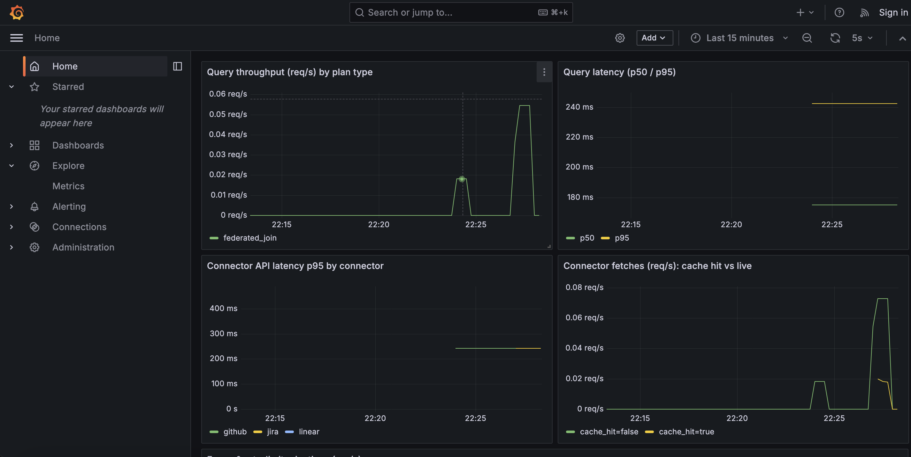
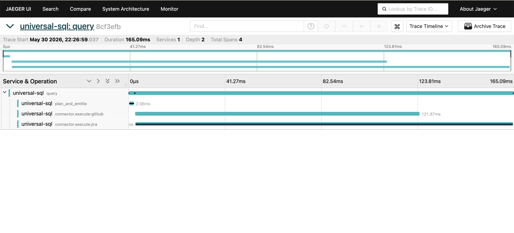
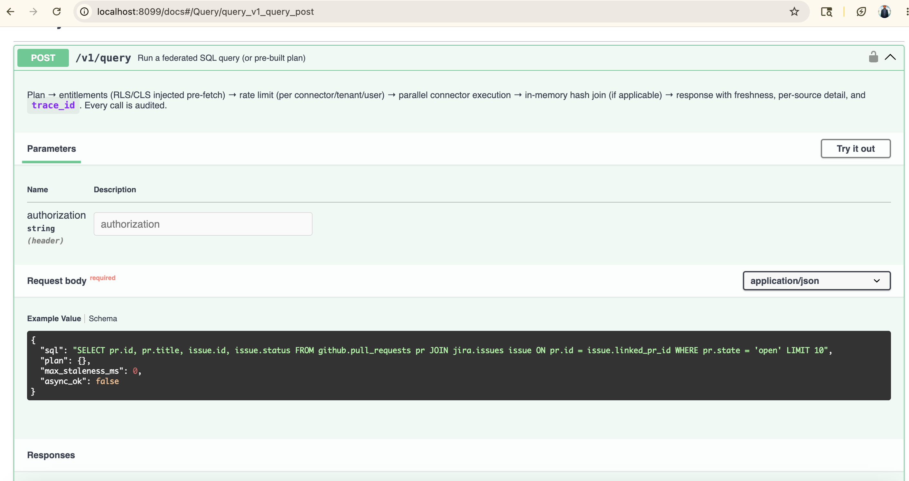

# Universal SQL Layer — Prototype (GitHub ↔ Jira)

A focused, end-to-end prototype of a universal SQL query layer that federates
SQL across SaaS APIs. It implements the headline ideas from the design doc in
working code: **plan-time entitlements (RLS/CLS), per-connector rate limiting
with an async overflow path, a freshness cache with staleness control, and a
cross-app federated join** — all behind a single `POST /v1/query`.

- Architecture, STRIDE threat model, cost levers, chaos plan: [`design_doc.md`](./design_doc.md)
- 6-month execution plan (prototype → GA): [`PLAN_OF_ACTION.md`](./PLAN_OF_ACTION.md)
- What the trace/metrics prove: [`docs/observability_note.md`](./docs/observability_note.md)

Scenario: **GitHub pull requests ↔ Jira issues**, joined on `pr.id =
issue.linked_pr_id`. A third connector — **Linear issues** — was added to
validate that the contract holds for a 3rd source with no changes to the hot
path (`main.py`, `executor.py`, `planner.py`, `entitlements.py`,
`ratelimit.py`, `observability.py`). All three connectors are **deterministic
in-process mocks** (fixtures in `src/fixtures/`) so demos and load tests are
reproducible without OAuth setup or burning real API quota.

> Adding a new connector takes 6 file touches (~150 LoC). A reusable skill at
> [`.claude/skills/add-connector/SKILL.md`](./.claude/skills/add-connector/SKILL.md)
> automates the recipe end-to-end — see [Extending: adding a new connector](#extending-adding-a-new-connector).
>
> **For real APIs**, two live connectors (`gh_live`, `jira_live`) ship alongside
> the mocks. The reproducible demo is a cross-app SQL join between
> `github.com/apache/kafka` PRs and Apache's public Jira, no Atlassian account
> needed — see [Live connectors (real GitHub + real Jira)](#live-connectors-real-github--real-jira).

---

## Quickstart (< 5 minutes)

**Recommended: Docker compose.** One command brings up the app + Prometheus +
Grafana + Jaeger + a traffic generator, so every dashboard populates on its own.

```bash
cd universal-sql
docker compose up -d --build
```

Five containers start (~30 s); the `loadgen` container drives mixed traffic
in the background. Confirm with `docker compose ps`.

### 🖥️ What to open

| URL | What you'll see |
|---|---|
| **<http://localhost:8099/ui/>** | **Bundled query console.** Pick `admin` / `eng` and click an example chip — mints a JWT in-browser via `/v1/dev/token`. Example chips render dynamically from `/healthz`, so live connectors (`gh_live`, `jira_live`) appear with a distinct accent border *only* when env vars are set. Response is pretty-printed with `sources[].version`, `cache_hit`, `freshness_ms`, `partial`, and `trace_id`. |
| <http://localhost:8099/docs> | **Swagger** — interactive API explorer; click **Authorize**, paste the token from the UI, then **Try it out**. |
| <http://localhost:3000> | **Grafana** — opens directly on the "Universal SQL Layer" dashboard (anonymous admin, no login). Throughput by `plan_type`, p50/p95 latency, per-connector latency, cache hit vs live, errors. |
| <http://localhost:16686> | **Jaeger** — service `universal-sql` → open any `query` trace to see the parallel `connector.execute:github` and `:jira` spans of a federated join. Paste the `trace_id` from any response into `/trace/<id>` for a direct link. |
| <http://localhost:9090> | **Prometheus** — for raw `usql_*` queries (e.g. `histogram_quantile(0.95, rate(usql_query_duration_seconds_bucket[5m]))`). |

> **No Docker?** See [Tier 2 in Deploy & test](#deploy--test) below — same
> app, no observability UIs, faster iteration on code changes.

### Or via terminal

```bash
# in another terminal: mint dev tokens (HS256 stands in for OIDC)
source .venv/bin/activate
ENG=$(python -m src.auth eng acme-corp)        # restricted role
ADMIN=$(python -m src.auth admin acme-corp)    # sees everything

# Cross-app join: open PRs and their Jira issues
curl -s localhost:8099/v1/query -H "Authorization: Bearer $ADMIN" \
  -H 'content-type: application/json' \
  -d '{"sql":"SELECT pr.id, pr.title, issue.id, issue.status FROM github.pull_requests pr JOIN jira.issues issue ON pr.id = issue.linked_pr_id WHERE pr.state = '\''open'\'' LIMIT 10"}' \
  | python -m json.tool
```

Every response carries `freshness_ms`, `rate_limit_status`, per-source `sources`
(cache_hit + freshness + connector version), `partial`, `annotations`, and `trace_id`.

```bash
# Same shape, different source — joins PRs to the third connector (Linear).
# Proves the connector contract holds for sources beyond github/jira.
curl -s localhost:8099/v1/query -H "Authorization: Bearer $ADMIN" \
  -H 'content-type: application/json' \
  -d '{"sql":"SELECT pr.id, pr.title, lin.id, lin.team_key, lin.state FROM github.pull_requests pr JOIN linear.issues lin ON pr.id = lin.linked_pr_id LIMIT 10","max_staleness_ms":0}' \
  | python -m json.tool
```

You can also pass a pre-built **`plan` JSON** instead of `sql` (same entitlement +
rate-limit + freshness path), and every query — including denials — is recorded to
the audit trail at **`GET /v1/audit`**.

```bash
# plan JSON instead of SQL
curl -s localhost:8099/v1/query -H "Authorization: Bearer $ADMIN" \
  -H 'content-type: application/json' -d '{"plan":{
    "sources":[{"connector":"github","table":"pull_requests","alias":"pr",
                "select":["id","state"],
                "where":[{"column":"state","op":"=","value":"open"}]}],
    "limit":50}}'

curl -s localhost:8099/v1/audit | python -m json.tool   # recent audit events
```

### See the four headline behaviours

```bash
# RLS — eng sees only ENG/PLATFORM Jira projects (OPS filtered at plan time)
curl -s localhost:8099/v1/query -H "Authorization: Bearer $ENG" \
  -H 'content-type: application/json' \
  -d '{"sql":"SELECT i.id, i.project_key FROM jira.issues i LIMIT 50"}'

# CLS mask — author_email is masked for eng; CLS block — selecting a blocked
# column is denied (403 ENTITLEMENT_DENIED)
curl -s localhost:8099/v1/query -H "Authorization: Bearer $ENG" \
  -H 'content-type: application/json' \
  -d '{"sql":"SELECT pr.author, pr.author_email FROM github.pull_requests pr LIMIT 2"}'
curl -s localhost:8099/v1/query -H "Authorization: Bearer $ENG" \
  -H 'content-type: application/json' \
  -d '{"sql":"SELECT i.internal_notes FROM jira.issues i LIMIT 1"}'

# Freshness — first call is live (cache_hit=false), repeat is a hit;
# max_staleness_ms:0 forces a live fetch
curl -s localhost:8099/v1/query -H "Authorization: Bearer $ADMIN" \
  -H 'content-type: application/json' \
  -d '{"sql":"SELECT i.id FROM jira.issues i WHERE i.project_key='\''ENG'\'' LIMIT 5"}'

# Rate limit — deplete the per-user bucket, then watch the friendly 429
for i in $(seq 1 35); do
  curl -s -o /dev/null localhost:8099/v1/query -H "Authorization: Bearer $ENG" \
    -H 'content-type: application/json' \
    -d '{"sql":"SELECT pr.id FROM github.pull_requests pr LIMIT 1"}'
done
curl -i -s localhost:8099/v1/query -H "Authorization: Bearer $ENG" \
  -H 'content-type: application/json' \
  -d '{"sql":"SELECT pr.id FROM github.pull_requests pr LIMIT 1"}'    # -> 429 + Retry-After

# Rate-limit async reroute — same depleted bucket, opt into async
curl -s localhost:8099/v1/query -H "Authorization: Bearer $ENG" \
  -H 'content-type: application/json' \
  -d '{"sql":"SELECT pr.id FROM github.pull_requests pr LIMIT 1","async_ok":true}'  # -> 202 + job_id
curl -s localhost:8099/v1/jobs/<job_id>                                            # poll until rows
```

---

## Deploy & test

Three tiers, recommended first. **Tier 1 (Docker compose) is the intended
path for this project** — one command, the full observability stack, and a
traffic generator driving the dashboards. Tier 2 (local uvicorn) trades the
dashboards for fast code iteration.

**Tier 1 — Docker compose (recommended, zero cost):**
```bash
docker compose up -d --build      # app + Prometheus + Grafana + Jaeger + loadgen
# UI:        http://localhost:8099/ui/
# Swagger:   http://localhost:8099/docs
# Grafana:   http://localhost:3000
# Jaeger:    http://localhost:16686
# Prometheus http://localhost:9090
```

**Tier 2 — local uvicorn (no Docker; fast iteration):**
```bash
python3 -m venv .venv && source .venv/bin/activate
pip install -r requirements.txt

USQL_DEV_TOKEN_ENDPOINT=1 uvicorn src.main:app --port 8099   # run the app

python -m pytest tests/ -q                        # automated tests
python scripts/snapshot.py                        # terminal Gantt + metrics (your screenshot)
ADMIN=$(python -m src.auth admin acme-corp)       # mint a token, then curl /v1/query (see above)
```
Load test (Docker compose already runs loadgen continuously; this is for the
local path or for a controlled k6 burst):
```bash
USQL_RATELIMIT_RPM_MULTIPLIER=100000 USQL_TRACE_CONSOLE=0 \
  uvicorn src.main:app --port 8099 --workers 4    # terminal 1
python load/load_local.py --duration 30 --concurrency 24   # terminal 2  (or k6, see below)
```

> All Python commands above need the venv active (`source .venv/bin/activate`)
> or call binaries directly (`.venv/bin/uvicorn`, `.venv/bin/python`).

**Tier 3 — cloud (EKS):** the `infra/` Terraform/Helm is a **design scaffold,
not `apply`-able** (no cloud auth/backend; see [`infra/README.md`](./infra/README.md)).
A real deploy also needs: build+push the image, a TF remote backend, RDS/IAM/IRSA/
ingress wiring, OIDC instead of the dev JWT, and real connector OAuth. Out of
scope for the take-home.

---

## Tests

```bash
source .venv/bin/activate
python -m pytest tests/ -q        # 27 tests: entitlements, rate limit + async, freshness, partial, audit, plan, pagination, Linear connector
```

## Load test

```bash
# raise rate-limit budgets and silence console trace export for the run
USQL_RATELIMIT_RPM_MULTIPLIER=100000 USQL_TRACE_CONSOLE=0 \
  uvicorn src.main:app --port 8099 --workers 4

# k6 (intended tool):
TOKEN=$(python -m src.auth eng acme-corp) k6 run -e TOKEN=$TOKEN load/query_load.js
# or the dependency-light fallback (no k6 needed):
python load/load_local.py --duration 30 --concurrency 24
```

Captured numbers + honest caveats: [`docs/load_result.txt`](./docs/load_result.txt)
(~586 req/s aggregate, 0 errors, p50 ~4 ms on the hot path).

## Observability

- `GET /v1/connectors` — registered connectors with their semver (`version`
  in `ConnectorManifest`), declared tables, pushable filter columns, and
  ETag support. Same `version` appears in every query response's `sources[]`
  entry and in audit events so a result is reproducibly attributable to a
  specific connector version.
- `GET /metrics` — Prometheus (query duration, per-connector latency by
  cache-hit, rate-limit rejections, query errors).
- OpenTelemetry spans print to the server console (console exporter). Captured
  samples: [`docs/trace_sample.json`](./docs/trace_sample.json),
  [`docs/metrics_sample.txt`](./docs/metrics_sample.txt).
- `GET /v1/audit` — append-only audit trail of every cross-system access and
  denial (user, tenant, tables/columns touched, RLS predicates applied, rows,
  duration). **Admin-only and scoped to the caller's tenant.** Compliance signal
  per design §11.4. (`/v1/trace/latest` is likewise admin-only + tenant-scoped.)

### Quick trace + metrics snapshot (no Docker)

```bash
uvicorn src.main:app --port 8099        # terminal 1
python scripts/snapshot.py              # terminal 2
```

Renders a screenshot-ready view from the running app alone — a Gantt of one
cross-app query's trace (showing `github`/`jira` running in parallel with their
real per-connector times) plus a metrics summary (throughput, cache-hit ratio,
per-connector latency, errors). Output is also saved to
[`docs/trace_view.txt`](./docs/trace_view.txt). Backed by an in-process span
collector exposed at `GET /v1/trace/latest`.

### Observability stack URLs

The Docker compose stack (the recommended Quickstart) exposes the full set:

| URL | Why look at it |
|---|---|
| http://localhost:3000 | **Grafana** — "Universal SQL Layer" dashboard auto-opens. Watch how `cache_hit` curves separate `github`/`jira`/`linear` per-connector latency, and how `plan_type` splits `single_source` vs `federated_join` throughput. |
| http://localhost:16686 | **Jaeger** — federated-join trace shows `connector.execute:github` and `:jira` overlapping in parallel; the root `query` span is only ~5 ms longer than the slower of the two. Paste any response's `trace_id` into `/trace/<id>` for a direct link. |
| http://localhost:8099/docs | **Swagger** — interactive API explorer with Bearer JWT scheme registered. |
| http://localhost:8099/metrics | Raw Prometheus metrics for ad-hoc inspection. |
| http://localhost:9090 | Prometheus UI for PromQL queries. |

Tracing exporter is env-driven: `OTEL_EXPORTER_OTLP_ENDPOINT` → Jaeger
(compose default), else console spans (local `uvicorn`), gated by
`USQL_TRACE_CONSOLE`.

#### Screenshots ([`docs/screenshots/`](./docs/screenshots))

| Grafana dashboard | Jaeger federated-join trace | Swagger UI |
|:---:|:---:|:---:|
| [](./docs/screenshots/grafana.png) | [](./docs/screenshots/jaeger.png) | [](./docs/screenshots/swagger.png) |
| Live traffic from `loadgen`: throughput, p50/p95, per-connector latency (github, jira, **linear**), cache-hit vs live. | The 4-span trace of one `POST /v1/query` join — `connector.execute:github` and `:jira` run in parallel (~120 ms and ~160 ms); the root `query` is only ~5 ms longer than the slower side. | `POST /v1/query` with the example SQL prefilled and Bearer-JWT auth wired in. |

---

## Supported SQL & policy

- `SELECT` (columns or `*`) · `WHERE` (AND of `= != < > <= >=` and `IN`) ·
  one `INNER JOIN ... ON a.x = b.y` · `ORDER BY` · `LIMIT` · `OFFSET`
  (pagination). `OR` and multi-JOIN are rejected rather than mis-handled.
- Tables: `github.pull_requests`, `jira.issues` (schema in `src/settings.py`).
- Entitlement policy: [`policy.yaml`](./policy.yaml) — per-role `row_filter`
  (RLS), `masks` (CLS), and `blocked` columns. Roles `eng` (restricted) and
  `admin` (unrestricted) are provided.

## Error vocabulary

| Code | HTTP | Meaning |
|---|---|---|
| `UNAUTHENTICATED` | 401 | Missing/invalid JWT |
| `ENTITLEMENT_DENIED` | 403 | Table not allowed, or a blocked column was selected |
| `INVALID_SQL` | 400 | Parse error / unsupported SQL |
| `QUERY_TOO_COMPLEX` | 422 | e.g. more than one JOIN |
| `RATE_LIMIT_EXHAUSTED` | 429 | Token bucket empty; `Retry-After` + `async_available` |
| `SOURCE_TIMEOUT` | 200 (partial) | A source missed its per-source deadline; `partial:true` |
| `REQUEST_TIMEOUT` | 200 (partial) | Whole query exceeded the gateway deadline (backstop) |
| `STALE_DATA` | 200 | Live fetch failed; served within `stale_if_error` window |

---

## Security posture

Enforced in the running prototype:
- **AuthN** on every query (JWT; `401` on missing/invalid/expired).
- **AuthZ + least-privilege at plan time** — table allow/deny, RLS row filters,
  CLS masks/blocks injected into the plan *before* any connector call; holds
  across joins and the `plan` JSON path.
- **No SQL injection** — AST parsing (sqlglot), structured predicates, no string
  interpolation; `plan` input is validated against the schema catalog.
- **Tenant isolation in the cache** — keys are `{tenant_id, connector, fingerprint}`
  (fingerprint includes RLS), so no cross-tenant/cross-role cache bleed.
- **Audit + trace endpoints are admin-only and tenant-scoped**, and the async
  **job poll (`/v1/jobs/{id}`) is owner-scoped** — results never leak across
  tenants/users even if a job id is known.
- **Rate limiting** per connector/tenant/user, atomic across connectors.

Design-only (see design doc §11 STRIDE): TLS/mTLS, per-tenant KMS encryption,
network isolation, org off-boarding + crypto-shred, data-residency tags.

Honest dev simplifications: auth is a symmetric **HS256 dev token** (prod uses
OIDC/JWKS); the signing key defaults to a clearly-named placeholder in
`settings.py` / `docker-compose.yml` and would come from Vault/env in production.
`/metrics` is unauthenticated (standard for Prometheus; network-restricted in prod).

---

## Key trade-offs (rationale)

- **Entitlements at plan time, not after fetch.** RLS row filters compile to
  predicates and are injected into the plan *before* any connector call, and a
  selected blocked column is rejected outright. A connector never fetches rows
  or columns the user may not see — verified across a join (`eng` can't see OPS
  issues even by joining). Trade-off: the policy filter language is a small SQL
  subset, not arbitrary Rego.
- **Federated by default, materialization as an escape hatch.** Joins run as an
  in-memory hash join (build from the smaller side). The design spills to
  DuckDB/S3 above a row threshold; the prototype implements the in-memory path
  and documents the boundary rather than building the spill.
- **Fail-fast rate limiting + opt-in async.** Three nested token buckets
  (connector/tenant/user) are checked before execution. Default is a friendly
  `429` with `Retry-After`; `async_ok:true` reroutes to a job + poll so a
  dashboard can degrade gracefully instead of erroring.
- **Freshness is a per-query knob with a floor.** `max_staleness_ms` lets a
  caller trade freshness for latency; a per-source `min_freshness_ms` floor
  (here 0 for demoability) would in production cap how aggressively clients can
  bypass cache, protecting source rate limits. ETag/304 and stale-if-error keep
  quota usage low and survive source blips.
- **In-process stand-ins for infra.** Redis token buckets, the L2 cache, Vault,
  per-tenant KMS, and multi-region are described in the design doc but
  represented here as in-process equivalents so the prototype runs with zero
  dependencies. Stateless data-plane components mean the real system scales
  horizontally to the 1k-QPS target.

## Known simplifications (prototype vs. design)

Two deliberate divergences from `design_doc.md`, called out for honesty:

- **Entitlements model tenant policy only, not source permissions.** Design §7.1
  merges *two* signals — what the connector's OAuth token can access (source
  permissions) **and** tenant policy. The prototype implements the tenant-policy
  side (`policy.yaml` role → RLS/CLS); the mock connectors don't model a token's
  own scope. In production the entitlement service would intersect both, so the
  effective filter is the *narrower* of source grant and tenant rule.
- **`SELECT *` is denied when a blocked column exists, rather than silently
  stripping it.** Selecting a blocked column (explicitly or via `*`) returns
  `403 ENTITLEMENT_DENIED`. This is the stricter least-privilege reading; the
  design's "strip from the projected column list" wording would instead omit the
  column from `*`. Either is defensible — we chose fail-loud over silently
  returning fewer columns than asked.

## Extending: adding a new connector

The hot path (gateway → planner → entitlements → rate limit → executor → freshness)
is connector-agnostic and routes by string name. Adding a third source touches
exactly **6 places, ~150 LoC**:

| File | Change |
|---|---|
| `src/connectors/<name>_mock.py` | New: subclass `Connector`, implement `describe()` + `execute()` |
| `src/connectors/jira_mock.py` `get_registry()` | Register the new connector |
| `src/settings.py` | Add `ConnectorConfig` + `SCHEMA_CATALOG` entries |
| `policy.yaml` | Add `can_access` + optional RLS/CLS per role |
| `src/fixtures/<name>_<table>.json` | Mock data; align FK columns to enable joins |
| `tests/test_<name>.py` | Mirror `test_entitlements.py` for admin + eng + a federated join |

**Zero touches** to `main.py`, `executor.py`, `planner.py`, `entitlements.py`,
`ratelimit.py`, `observability.py` — rate limiting, freshness, audit, /docs, the
Grafana panels and Jaeger trace all auto-pick-up the new connector by name.

[`.claude/skills/add-connector/SKILL.md`](./.claude/skills/add-connector/SKILL.md)
codifies this as a reusable Claude Code skill — invoke with `/add-connector` or
ask "add a Linear connector" and it drives the six steps end-to-end, including
the pytest verification and live-server probe. The skill was test-driven by
adding the **Linear issues** connector that ships in the prototype; the
generated files are the existing `linear_mock.py` + fixture + tests.

## Live connectors (real GitHub + real Jira)

Two optional connectors talk to **real** SaaS APIs alongside the mocks:

- `gh_live.pull_requests` — GitHub REST (`/repos/{owner}/{repo}/pulls`).
- `jira_live.issues` — Jira REST (`/rest/api/{v}/search`). Cloud (v3, Basic auth)
  or public Server (v2, anonymous — e.g. `issues.apache.org/jira`).

They register only when their env vars are set; without credentials the schema
catalog still declares them but the registry skips them and the existing tests
run unchanged. **Mocks remain the reproducible default** so load tests and
demos don't burn real API quota.

### Apache Kafka demo — real cross-app join in ~3 minutes

The interesting part: `github.com/apache/kafka` PRs and `issues.apache.org/jira`
`KAFKA` issues are joinable because the project follows Smart-Commits naming
(`KAFKA-12345: …` in PR titles). The `gh_live` connector regex-extracts the
key into `linked_issue_key`; the planner joins on that against `jira_live.issues.id`.

```bash
# 1) Create a fine-grained PAT scoped to apache/kafka (read-only "Pull requests: Read")
#    at https://github.com/settings/personal-access-tokens/new

# 2) Copy the template and fill in your token. Other values can stay as-is.
cp .env.example .env.live
$EDITOR .env.live
#   GITHUB_TOKEN=github_pat_...
#   GITHUB_REPOS=apache/kafka
#   JIRA_BASE_URL=https://issues.apache.org/jira    # public, no auth
#   JIRA_API_VERSION=2
#   JIRA_PROJECTS=KAFKA

# 3) Bring up the stack (docker-compose reads .env.live automatically)
docker compose up -d --build app
curl -s localhost:8099/healthz | python3 -m json.tool
# {"connectors":["github","jira","linear","gh_live","jira_live"]}

# 4) Mint an admin token (same JWT secret compose uses)
ADMIN=$(USQL_JWT_SECRET=demo-shared-secret python -m src.auth admin acme-corp)

# 5) THE join — real GitHub PRs ⨝ real Jira issues, parallel fan-out
curl -s localhost:8099/v1/query -H "Authorization: Bearer $ADMIN" \
  -H 'content-type: application/json' \
  -d '{"sql":"SELECT pr.id, pr.title, j.id, j.status, j.assignee FROM gh_live.pull_requests pr JOIN jira_live.issues j ON pr.linked_issue_key = j.id WHERE j.project_key = '\''KAFKA'\'' LIMIT 10","max_staleness_ms":0}' \
  | python3 -m json.tool
```

Sample output (real data, ~1.5s, both sources hit in parallel):

```json
"rows": [
  [22416, "KAFKA-20639: Move EnvelopeUtils to server module",   "KAFKA-20639", "Open",            "majialong"],
  [22426, "KAFKA-20645: Move LogLoaderTest to storage module",  "KAFKA-20645", "Open",            "Mickael Maison"],
  [22394, "KAFKA-20633: Update default value of remote copy …", "KAFKA-20633", "Patch Available", "Kamal Chandraprakash"]
]
"sources": [
  {"connector":"gh_live",   "cache_hit":false, "freshness_ms":0, "status":"ok"},
  {"connector":"jira_live", "cache_hit":false, "freshness_ms":0, "status":"ok"}
]
"trace_id": "6d1bee5fcd07d3dd3edf87c3ba5aa372"
```

The `trace_id` opens directly in Jaeger at
`http://localhost:16686/trace/<trace_id>` — you'll see two `connector.execute:gh_live`
and `connector.execute:jira_live` spans running in parallel, with their real
HTTP latencies (no simulated delay).

### What pushes down vs post-filters

| Predicate | gh_live → REST | jira_live → JQL |
|---|---|---|
| `state = X` | ✅ `?state=X` | — |
| `repo_name = X` / `IN (...)` | ✅ chooses repos to call | — |
| `project_key = X` / `IN (...)` | — | ✅ `project = X` / `project in (...)` |
| `status = X` | — | ✅ `status = "X"` |
| `assignee = X` | — | ✅ `assignee = "X"` |
| `id = "KEY-N"` | — | ✅ `key = "KEY-N"` |
| Anything else (`< > <= >= !=` …) | post-filter in executor | post-filter in executor |

Pagination short-circuits at the plan's `LIMIT` so a `LIMIT 10` query against
KAFKA (19k+ issues) returns in ~1.5s, not ~30s.

### Schema differences from the mocks (deliberate)

| Mock field | Live equivalent | Why |
|---|---|---|
| `github.pull_requests.author_email` | (omitted) | GitHub API doesn't expose user emails |
| `github.pull_requests.id` (sequential) | `gh_live.pull_requests.id` (real PR number) | Direct mapping to `number` |
| `jira.issues.linked_pr_id` (int) | `gh_live.pull_requests.linked_issue_key` (string `KAFKA-123`) | Real Jira has no `linked_pr_id`; key extraction from PR title is the realistic option |
| `jira.issues.internal_notes` | (omitted) | Not a real Jira field |
| `jira.issues.description` | `jira_live.issues.description` | ADF (Cloud v3) auto-flattened to plain text; truncated to 500 chars |

The CLS mask/block demos (`author_email`, `internal_notes`) therefore use the
mocks. RLS row filters apply uniformly across both — the same `policy.yaml`
mechanism injects predicates into the live JQL just like into the mock filter
matcher.

## Infrastructure scaffold

[`infra/`](./infra/) contains a **reviewable Terraform + Helm scaffold** (module
layout, the `deployment_mode` single-↔multi-tenant toggle, per-tenant KMS,
autoscaling, canary) that makes design doc §12 concrete. It is intentionally
**not** `apply`-able (no cloud auth/backend) — see [`infra/README.md`](./infra/README.md).


## Plan of action

The detailed 6-month execution plan — milestone-level engineering tasks with
file paths and effort estimates, cross-cutting workstreams, post-GA roadmap,
strategic decisions to revisit in flight, and plan invariants drawn from the
prototype build — lives in [`PLAN_OF_ACTION.md`](./PLAN_OF_ACTION.md).
