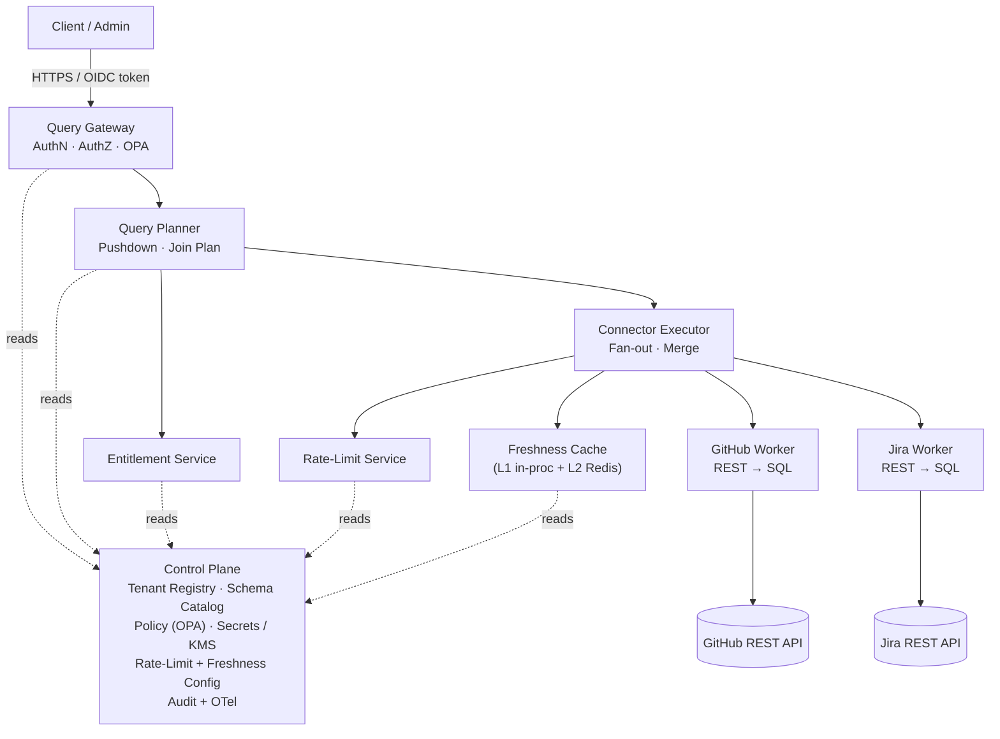
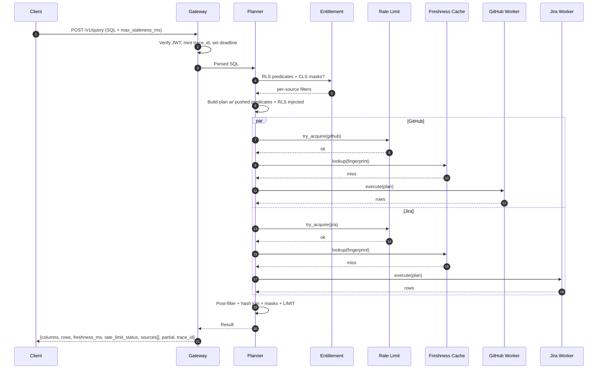

# Universal SQL Layer — Architecture Design Document

> **Scenario:** GitHub ↔ Jira (PRs ↔ Issues), with Linear as a third source.
> **Version:** 1.1 | **Status:** Draft

---

## Table of Contents

1. [Overview & Goals](#1-overview--goals)
2. [Architecture](#2-architecture)
3. [Control Plane](#3-control-plane)
4. [Data Plane](#4-data-plane)
5. [Query Lifecycle](#5-query-lifecycle)
6. [Connector SDK](#6-connector-sdk)
7. [Entitlement Model (RLS/CLS)](#7-entitlement-model-rlscls)
8. [Rate-Limit Design](#8-rate-limit-design)
9. [Freshness Layer](#9-freshness-layer)
10. [Join Strategy](#10-join-strategy)
11. [Security & Compliance](#11-security--compliance)
12. [Deployment Modes](#12-deployment-modes)
13. [Observability](#13-observability)
14. [Capacity Planning](#14-capacity-planning)
15. [Error Vocabulary](#15-error-vocabulary)
16. [Cost Levers](#16-cost-levers)
17. [Chaos Engineering Plan](#17-chaos-engineering-plan)

> The 6-month execution plan lives in [`PLAN_OF_ACTION.md`](./PLAN_OF_ACTION.md).
> The running prototype + reproducible demos live in [`README.md`](./README.md).
> This document covers architecture; the plan covers how it's built and shipped.

---

## 1. Overview & Goals

The Universal SQL Layer exposes a single query interface (`POST /v1/query`) that
federates SQL across heterogeneous SaaS APIs. It translates SQL into coordinated
API calls, enforces authorization policies, respects source rate limits, and
returns enriched results with freshness and trace metadata.

**Scale targets:** 10M users · 1k QPS peak · ~100 MB/s data throughput
**Latency SLOs:** P50 < 500 ms · P95 < 1.5 s (single-source pushed-down queries)
**Availability:** 99.9% monthly on the Query Gateway

### Core design principles

- **Federated by default; materialize only as escape hatch.** Queries run live
  against sources. Spill to DuckDB+S3 only when join cardinality forces it.
- **Entitlements at plan time, not execution time.** RLS/CLS rules are baked
  into the plan *before* any connector is called — no over-fetch-then-filter.
- **Graceful degradation over hard failures.** A slow source returns
  `partial:true` with `SOURCE_TIMEOUT`; the query as a whole still succeeds.
- **Tenant-scoped everything.** Encryption keys, rate-limit budgets, audit
  logs, network boundaries, and **cache keys** are tenant-scoped from day one.
- **Connector contract is the load-bearing abstraction.** A new source ships
  in ~150 LoC + zero hot-path edits. Demonstrated by 3 mocks + 2 live
  connectors in the prototype.

---

## 2. Architecture



The data plane is stateless and horizontally scaled. The control plane carries
all mutable state. Each component above is a separate Kubernetes deployment
in production; the prototype collapses them into one FastAPI process for
testability.

---

## 3. Control Plane

Configuration + policy backbone. Read-heavy, latency-tolerant. Postgres-backed.

| Component | Purpose | Storage |
|---|---|---|
| **Tenant Registry** | `tenant_id`, `tier`, `deployment_mode`, `kms_key_arn`, `data_residency_region`, `connector_bindings[]`, `off_boarding_state` | Postgres |
| **Schema Catalog** | Virtual table/column definitions per connector type, versioned by `schema_version`. Drift detected by background reconciler polling each connector's `describe()` | Postgres + 60s in-proc cache |
| **Policy Store** | Rego policies in Git, deployed via OPA bundle API; expresses table allow/deny + RLS predicates + CLS masks | OPA sidecar + Git source |
| **Secrets / KMS** | Vault for connector OAuth tokens + API keys, encrypted at rest with per-tenant KMS keys. 5-min AppRole lease cache; Vault dynamic secrets handle rotation; break-glass dual-approval | Vault + AWS/GCP KMS |
| **Rate-Limit Config** | Per-connector/tenant/user buckets (`requests_per_minute`, `burst_capacity`, `concurrency`, `async_overflow`) | Redis (live config + bucket state) |
| **Freshness Config** | Per-source `default_ttl_ms`, `min_freshness_ms`, `stale_if_error_ms`, `supports_etag` | Postgres |
| **Audit + OTel** | Every cross-system access logged immutably; spans emitted to OTel | S3 WORM + Tempo/Jaeger |

### Connector versioning

Every connector's `describe()` returns a semver string. The planner records
the version it consulted; the executor records the version it called. Result
attribution and reproducibility require the version to be in the audit event
and in the per-source detail of every response.

---

## 4. Data Plane

Stateless, horizontally scaled. Each component is independently deployable.

### 4.1 Query Gateway

Single entry point. AuthN validates an OIDC JWT via JWKS (cached, rotation-
tolerant; `401` on failure). AuthZ evaluates OPA `data.authz.allow` with
`{user, tenant, tables, columns}`. Request shaping applies per-tenant
complexity caps (max JOINs, max rows, timeout) and injects a 32-char OTel
trace ID — the same format Jaeger indexes by, so a client can open
`/trace/<id>` directly. Hard kill at `request_timeout_ms` (default 30 s) is
a backstop; per-source deadlines usually trip first. Every response carries
`freshness_ms`, `rate_limit_status`, `sources[]` (per-connector cache_hit
+ freshness + status + **connector version**), `partial`, `annotations`,
and `trace_id`.

### 4.2 Query Planner

Parses SQL with an AST library (the prototype uses `sqlglot`). Subset:
`SELECT` projection, `WHERE` (AND-of-equalities + `IN`), single `INNER JOIN`,
`ORDER BY`, `LIMIT`, `OFFSET`. Produces a structured plan:

```json
{
  "plan_type": "federated_join",
  "sources": [
    {
      "connector": "github",
      "table": "pull_requests",
      "pushed_predicates": [{"column": "state", "op": "=", "value": "open"}],
      "post_predicates": [],
      "projected_columns": ["id", "title", "author"],
      "rls_predicates": [{"column": "repo_name", "op": "IN", "value": ["acme/api", "acme/frontend"]}],
      "masked_columns": {"author_email": "mask_email"}
    },
    {
      "connector": "jira",
      "table": "issues",
      "pushed_predicates": [],
      "post_predicates": [],
      "projected_columns": ["id", "title", "linked_pr_id"],
      "rls_predicates": [{"column": "project_key", "op": "IN", "value": ["ENG", "PLATFORM"]}],
      "masked_columns": {}
    }
  ],
  "join": {"left_alias": "pr", "left_column": "id",
           "right_alias": "issue", "right_column": "linked_pr_id"},
  "limit": 100
}
```

**Predicate pushdown is per-source.** The planner consults each connector's
capability manifest to decide what to push:
- **GitHub REST:** `state` → query param; `repo_name` → which `/repos/{owner}/{repo}/pulls` URL to call.
- **Jira JQL:** `project_key`, `status`, `assignee`, `id` → JQL clauses (`project in (…)` etc.).
- Anything not pushable becomes a `post_predicate` evaluated by the executor.

**Join cost model:** if both sides estimated < `MATERIALIZATION_THRESHOLD`
(default 50 k rows), the executor does an in-memory hash join. Above that the
planner spills to DuckDB+S3 (§10.3).

### 4.3 Connector Executor

Fans out to connector workers in parallel using `asyncio.gather` (or pool in
production). Implements:
- **Concurrency control** — per-tenant semaphore.
- **Pagination** — iterates pages with **early termination at the plan's
  `LIMIT`** (critical: without this, a `LIMIT 5` against a busy real source
  fetches 500+ rows and trips the per-source deadline).
- **Partial result collection** — slow source → `SOURCE_TIMEOUT` annotation;
  the others still return data.
- **Result merging** — applies post-filters, join, column masks, then `LIMIT`.

### 4.4 Connector Workers

Stateless implementations of the SDK (§6). Per call: fetch OAuth token from
Vault (5-min lease cache) → check Rate-Limit → check Freshness Cache (L1
in-process, L2 Redis) → on miss call the source paginating until the plan's
`LIMIT` is satisfied → cache + update rate-limit counters → return rows +
`etag` + `fetched_at_ms`.

The prototype ships two live connectors (`gh_live`, `jira_live`) registered
conditionally on env vars. Mocks remain registered so unit tests and load
tests never touch real APIs.

---

## 5. Query Lifecycle



A concrete response shape (real `apache/kafka` PRs joined to Apache Jira)
appears in the [README](./README.md#live-connectors-real-github--real-jira).

---

## 6. Connector SDK

Every connector implements a small Python contract (the prototype is Python;
production may be polyglot via gRPC):

```python
@dataclass
class ConnectorManifest:
    tables: list[str]
    pushable_filters: list[str]
    max_page_size: int
    supports_conditional_requests: bool
    version: str = "1.0.0"   # semver; bump major on breaking schema change

class Connector:
    name: str

    def describe(self) -> ConnectorManifest: ...
    async def execute(self, plan: SourcePlan, ctx: ConnectorContext) -> FetchResult: ...

    # Production-only (mocks skip these):
    def authenticate(self, credentials) -> AuthResult: ...
    def refresh_token(self, token) -> Token: ...
```

`FetchResult` carries rows + `etag` + `fetched_at_ms` + `not_modified` so the
freshness layer can serve 304s without re-fetching bodies.

### Versioning

`ConnectorManifest.version` is semver. Surfaced in `GET /v1/connectors`, in
every response's `sources[]` entry, and in audit events — so any result is
reproducibly attributable to a specific version. The schema catalog records
accepted versions per tenant binding; a tenant pinned to `v1` keeps working
when `v2` rolls out.

### Standard error codes a connector emits

| Code | Meaning |
|---|---|
| `RATE_LIMIT_EXHAUSTED` | Token bucket empty; include `retry_after_ms` |
| `STALE_DATA` | Live fetch failed; served cached within `stale_if_error_ms` |
| `CONNECTOR_AUTH_FAILURE` | Source rejected the credential / scope |
| `SOURCE_TIMEOUT` | Source missed its per-source deadline |
| `SCHEMA_DRIFT` | Source returned a shape inconsistent with the catalog |
| `PARTIAL_RESULT` | Pagination truncated at `max_rows` |

---

## 7. Entitlement Model (RLS/CLS)

The Entitlement Service combines **two signals** at plan time:

1. **Source permissions** — what the connector's OAuth token can actually
   access (e.g. only repos the user has `read` access to).
2. **Tenant policy** — OPA rules constraining what the user may see within
   the system (e.g. `eng` role may only see `ENG`/`PLATFORM` projects).

The effective filter is the **narrower** of the two. Result, per source:

```json
{
  "github": {
    "row_filter": "repo_name IN ('acme/api', 'acme/frontend')",
    "blocked_columns": [],
    "masked_columns": {"author_email": "mask_email"}
  },
  "jira": {
    "row_filter": "project_key IN ('ENG', 'PLATFORM')",
    "blocked_columns": ["internal_notes"],
    "masked_columns": {}
  }
}
```

These filters are injected into the plan **before any connector is called**.
The connector never fetches rows or columns the caller may not see.

- **Blocked columns** — selecting one (explicit or via `*`) returns
  `403 ENTITLEMENT_DENIED`. Fail-loud over silently stripping.
- **Masked columns** — replaced server-side via a function defined in OPA
  (`mask_email("alice@acme.io") → "***@acme.io"`).
- **Policy compilation** — Rego policies are pre-compiled to plan fragments
  at policy-load time, not query time. The planner makes one OPA call per
  query; OPA returns structured JSON. No row-by-row OPA evaluation at scale.

> The prototype implements the tenant-policy side via `policy.yaml`; the
> source-permission intersection is M3 work in the plan. The injection
> mechanism is the same.

---

## 8. Rate-Limit Design

Three nested token-bucket scopes, all checked atomically per query:

```
Connector-level:  4000 req/min  (GitHub OAuth app limit)
  └─ Tenant-level: 400 req/min   (fair share across tenants)
     └─ User-level: 20 req/min   (prevent single-user monopoly)
```

Implemented as a Redis Lua script (`EVALSHA` for atomicity). If any bucket is
depleted, the request is rejected — fail-fast, not queued. Buckets initialize
with burst capacity (1.5× per-minute rate), refilling at the base rate so
bursty workloads (e.g. dashboard loading 20 widgets) don't exhaust the budget.

**Atomic across connectors.** A `github JOIN jira` query that fails on `jira`
must consume nothing from `github` — proven by test.

**Async overflow path.** When `async_ok:true` is set and `async_overflow:true`
is enabled for the connector, a rate-limited request is enqueued (Postgres
`jobs` table; revisit SQS in M5 if write QPS > 500). Response:

```http
HTTP/1.1 202 Accepted
{
  "status": "queued",
  "job_id": "abc123",
  "poll_url": "/v1/jobs/abc123",
  "retry_after_ms": 12000,
  "connector": "github"
}
```

Otherwise the response is the friendly 429:

```http
HTTP/1.1 429 Too Many Requests
Retry-After: 12
{
  "error": "RATE_LIMIT_EXHAUSTED",
  "message": "github connector budget exhausted at tenant scope for tenant acme-corp.
              Retry in ~12000 ms, or resubmit with \"async_ok\": true.",
  "retry_after_ms": 12000,
  "async_available": true,
  "trace_id": "…"
}
```

---

## 9. Freshness Layer

**Two levels per connector.** L1 = in-process LRU keyed by
`{tenant_id, connector, query_fingerprint}`. L2 = Redis cluster, same key,
encrypted at rest with a per-tenant DEK wrapped by a KMS KEK. **The
fingerprint includes the RLS predicate** so role-restricted queries don't
bleed across roles or tenants (proven empirically in the prototype: `eng`'s
same-shape query hits a different L1 entry from `admin`'s).

**ETag / conditional requests.** Sources that support it (GitHub does; Jira
doesn't) store the ETag with cached rows; the next request sends
`If-None-Match` and a `304` extends the TTL without burning quota. The
manifest's `supports_conditional_requests` field lets the planner know.

**Per-query staleness hint** — `{"max_staleness_ms": 5000}`. If cached data
is older, the worker bypasses cache. If the live fetch then fails, the
worker serves stale rows within `stale_if_error_ms` and annotates with
`STALE_DATA`.

**Single-flight revalidation** prevents stampede: one fetch per key under
concurrent miss; waiters share the result.

---

## 10. Join Strategy

The most important architectural trade-off.

### 10.1 Decision matrix

| Scenario | Strategy | Why |
|---|---|---|
| Both sides < 50 k rows | **In-memory hash join** | Fast, no infra overhead |
| Either side > 50 k rows | **Short-lived materialization** | Avoid OOM in executor pods |
| Aggregations (`GROUP BY`, `COUNT`) | **Short-lived materialization** | DuckDB is purpose-built |
| Cross-source `ORDER BY` + `LIMIT` | **Partial-sort merge** | Fetch top-N each, merge, truncate |

### 10.2 In-memory hash join (default)

Fan out to both connectors in parallel → build a hash table from the
smaller side → stream the larger side through it → emit matches. Memory
budget per query: `EXECUTOR_MEMORY_LIMIT / CONCURRENT_QUERIES`. 2 GB pods ×
20 concurrent → 100 MB/query → ~500 k rows at ~200 B/row.

### 10.3 Short-lived materialization (overflow)

Workers write result sets to S3 as Parquet (encrypted with the tenant KMS
key; `tenant_id` in the path). A DuckDB process loads both files in-memory,
runs the full SQL plan (join + aggregation), streams results to the
gateway. S3 objects deleted after a short TTL (10 min default). DuckDB runs
in-process (no cluster), handles Parquet natively, and is fast for
analytical joins; adds 2–5 s vs the in-memory path — acceptable for
analytics, avoided for lookups.

### 10.4 Join keys when sources have no native foreign key

Two real sources rarely share a structured join key. Pattern that works on
real federation:
- **Smart Commits convention** — extract a key from human-written text
  (e.g. PR title `KAFKA-12345: …` → `linked_issue_key` via regex
  `[A-Z][A-Z0-9]+-\d+`). Hash-join against the other source's `id`. This is
  how the prototype joins `github.com/apache/kafka` PRs to Apache Jira
  issues with zero schema cooperation between the sources.
- **GitHub-for-Jira dev-info API** when the integration is installed.
- **Custom mapping table** stored in the tenant registry.

The pattern lives in the connector (compute `linked_issue_key` at map time);
the planner just joins on the derived column.

---

## 11. Security & Compliance

### 11.1 STRIDE threat model

| Threat | Component | Mitigation |
|---|---|---|
| **Spoofing** | Gateway | OIDC JWT validation; JWKS rotation every 24 h |
| **Tampering** | SQL injection | AST parsing (sqlglot); structured predicates; no string interpolation |
| **Repudiation** | Cross-system access | Immutable audit log (append-only Postgres + S3 WORM archival) |
| **Info disclosure** | Connector credentials | Vault + per-tenant KMS; zero secrets in env vars |
| **Info disclosure** | Cross-tenant data | Namespace isolation; `tenant_id` in every cache key (proven); per-tenant DEK |
| **Denial of Service** | Gateway flood | Rate limiting at multiple scopes; circuit breaker per source |
| **Elevation of privilege** | OPA bypass | OPA evaluated server-side; policies deployed from Git only |

### 11.2 Network architecture

- TLS 1.3 at the edge.
- mTLS service-to-service via Istio.
- Connector workers egress through a dedicated NAT gateway (lets enterprise
  customers IP-allowlist the egress range).
- Per-tenant k8s namespaces with `NetworkPolicy` blocking cross-tenant pod
  comms.

### 11.3 Data residency & off-boarding

Every Postgres row and every S3 object carries `data_residency_region`; job
placement respects the tag. Off-boarding: revoke OAuth tokens via each
connector → delete bindings → `kms:ScheduleKeyDeletion` on the tenant KEK
(7-day window) — Redis cache entries become undecryptable (crypto-shred) →
delete S3 Parquet immediately, retain Postgres audit rows for 90 days then
purge.

### 11.4 Audit log

Every query (including denials and rate-limit rejections) writes:

```json
{
  "event_type": "query.execute",
  "timestamp": "2024-03-15T10:23:45Z",
  "trace_id": "6d1bee5fcd07d3dd3edf87c3ba5aa372",
  "user_id": "u_abc123",
  "tenant_id": "acme-corp",
  "role": "eng",
  "sql_fingerprint": "<hash>",
  "connectors_accessed": ["github", "jira"],
  "connector_versions": {"github": "1.0.0", "jira": "1.0.0"},
  "tables_accessed": ["github.pull_requests", "jira.issues"],
  "columns_accessed": ["title", "state", "author"],
  "rows_returned": 47,
  "duration_ms": 1240,
  "rls_predicates_applied": ["repo_name IN ('acme/api','acme/frontend')", "project_key IN ('ENG','PLATFORM')"],
  "masked_columns": {"github.pull_requests": ["author_email"]}
}
```

Production writes to S3 with Object Lock (WORM). Per-tenant export endpoint
for compliance.

---

## 12. Deployment Modes

| Mode | Isolation | Suited for |
|---|---|---|
| **Multi-tenant (default)** | Application-layer: k8s namespaces, NetworkPolicy, per-tenant KMS keys, per-tenant cache-key prefix | SMB / mid-market |
| **Single-tenant** | Separate cluster per tenant; connector workers, Redis, async queue all inside the tenant VPC | Enterprise compliance |

The same Terraform module ships both modes — `deployment_mode: single_tenant`
flips which sub-modules are instantiated. **No application code changes
between modes.** Helm chart values + Terraform variables determine the shape.

### IaC layout

```
modules/
├── networking/   # VPC, subnets, NAT, security groups
├── secrets/      # Vault, KMS, rotation policies
├── databases/    # Postgres (control plane), Redis (cache + rate limits)
├── cluster/      # EKS/GKE, node groups, autoscaling
└── connector-sdk/# Shared worker Helm chart
```

Pipeline: GitHub Actions → `terraform plan` review → `helm upgrade` with Argo
Rollouts canary (10% → 50% → 100% over 30 min). Auto-rollback if P95 SLO
breached for 5 consecutive minutes.

---

## 13. Observability

### 13.1 Metrics (Prometheus)

| Metric | Type | Labels |
|---|---|---|
| `query_duration_seconds` | Histogram | `tenant`, `plan_type`, `status` |
| `query_errors_total` | Counter | `error_code` |
| `rate_limit_exhausted_total` | Counter | `connector`, `scope` |
| `connector_api_latency_seconds` | Histogram | `connector`, `cache_hit` |
| `cache_hit_ratio` | Gauge | `connector`, `tenant` |
| `active_queries` | Gauge | `tenant` |
| `materialization_active` | Gauge | `tenant` |

### 13.2 Traces (OpenTelemetry)

Every query produces a trace with child spans for:
- `plan_and_entitle`
- `connector.execute:<name>` per source (with `cache_hit`, `rows_fetched`,
  `connector_version` attributes; runs in parallel for federated joins)
- `cache.lookup` (L1, L2)
- `join.execute`
- `result.serialize`

The trace ID returned in the API response is the **same** 32-char OTel ID
Jaeger indexes by, so a client can open `http://jaeger/trace/<id>` directly.

### 13.3 Alerts

- P95 latency > 1.5 s for 5 min → page on-call.
- Error rate > 1% for 2 min → page on-call.
- Rate-limit exhaustion > 10% for a tenant → notify tenant admin.
- Connector auth failure → alert within 1 min (token likely expired).
- `SCHEMA_DRIFT` rate > 0 → alert within 60 s of detection.

---

## 14. Capacity Planning

### 14.1 Sizing for 1k QPS

Assumptions: 2 connectors per query, 400 ms / 1.2 s P50/P95 per call, 60%
cache hit ratio, 500 rows × 300 B per result (~150 kB).

| Resource | Math | Outcome |
|---|---|---|
| External API calls | 1000 × 2 × 0.4 (miss rate) | ~800/s |
| GitHub tokens needed at peak | 5000/h per OAuth app | ~572 tokens (pooled per-tenant) |
| Redis ops | 1000 × 3 (rate-limit) + cache R/W | ~5 k ops/s (within 3-shard cluster) |
| Gateway pods | 100 ms × 1000 QPS @ 2 vCPU/pod | ~50 pods |
| Executor pods | 500 ms × 1000 QPS / 20 concurrent | ~25 pods |

### 14.2 Autoscaling + head-of-line blocking

HPA on CPU (70% target) **and** request-queue depth.
`minReplicas:3, maxReplicas:100`. Pre-warmed node pool → scale-up < 60 s;
5-min scale-down cooldown. Each connector has its own task pool — a slow
GitHub response does not block Jira in the same executor. Per-connector
circuit breakers (half-open after 30 s) prevent cascade.

---

## 15. Error Vocabulary

| Code | HTTP | Description | Client action |
|---|---|---|---|
| `RATE_LIMIT_EXHAUSTED` | 429 | Token bucket empty | Retry after `Retry-After`; opt into async |
| `STALE_DATA` | 200 | Live fetch failed; served cached | Accept stale or retry with backoff |
| `ENTITLEMENT_DENIED` | 403 | Table or column denied | Contact admin |
| `SOURCE_TIMEOUT` | 200 (partial) | Source missed deadline | Check `partial:true`; retry the missing source |
| `SCHEMA_DRIFT` | 422 | Connector returned unexpected shape | Catalog refresh; report to admin |
| `PARTIAL_RESULT` | 200 | Row limit truncated | Tighten `WHERE` or raise `LIMIT` |
| `INVALID_SQL` | 400 | Parse error / unsupported SQL | Fix query against the supported subset |
| `CONNECTOR_AUTH_FAILURE` | 502 | OAuth token invalid/revoked | Re-authorise connector |
| `QUERY_TOO_COMPLEX` | 422 | Exceeded complexity limit (e.g. multi-JOIN) | Split into smaller queries |
| `UNAUTHENTICATED` | 401 | Missing/invalid JWT | Re-authenticate |

---

## 16. Cost Levers

Cost in a federated layer is dominated by (a) outbound API calls,
(b) compute for joins/materialization, (c) cache/storage. Levers in order
of impact:

| Lever | Mechanism | Effect |
|---|---|---|
| **Cache hit ratio** | Tune `default_ttl_ms` per source/query class; ETag/304 revalidation | +10% hit ratio ≈ −10% outbound calls (the largest line item) and lower latency |
| **Predicate + column pushdown** | Push filters + projections to the source | Fewer rows/bytes fetched and parsed; smaller cache entries |
| **Async batching of overflow** | Coalesce rate-limited queries into batched source calls | Smooths spiky load under a fixed quota |
| **Materialization TTL** | Short S3/DuckDB lifecycle (≤10 min); lazy spill only above threshold | Caps storage; avoids materializing when in-memory suffices |
| **Per-tenant query budgets** | Cost attribution + budget caps in rate-limit config | Prevents a runaway dashboard from driving spend |
| **Right-sized autoscaling** | HPA on CPU + queue depth; scale-to-min off-peak; spot nodes for async workers | Matches compute to demand |
| **Connector tiering** | Cheap-to-poll sources get tight freshness; expensive APIs get longer TTL | Spends quota where it matters |

A per-tenant cost-attribution dashboard (outbound calls × connector unit
cost + compute-seconds + cache bytes) makes these observable; it's the
basis for M5's cost report.

---

## 17. Chaos Engineering Plan

Resilience is validated by injecting the failure modes the design claims to
tolerate. Each drill has a hypothesis and a pass condition: graceful
degradation, no data corruption, no cross-tenant leakage.

| Drill | Injection | Pass condition |
|---|---|---|
| **Slow connector** | Latency > per-source deadline on one source | `partial:true` + `SOURCE_TIMEOUT`; other sources unaffected (no HoL blocking) |
| **Connector outage** | Force 5xx / connection refused | Circuit breaker opens; stale-if-error serves cached rows within window; clean error otherwise |
| **Rate-limit flood** | Burst past connector budget | `429` + `Retry-After`; async overflow drains; fairness across tenants holds |
| **Cache stampede** | Expire a hot key under concurrent load | Single-flight revalidation; no thundering herd to source |
| **Redis eviction / loss** | Flush rate-limit + cache store | Fail-safe (fail-closed on limits, cache miss → live); no crash |
| **Pod kill** | Kill gateway/executor pods mid-query | In-flight queries fail cleanly; HPA replaces pods; no corruption |
| **Network partition** | Sever executor → source egress | Per-source timeout → partial; circuit breaker prevents cascade |
| **Cross-tenant red-team** | Tenant A token + Tenant B identifiers | Hard deny; cache keys + KMS scoping prevent any B data reaching A |

Drills run in staging on a schedule and as game-days before GA (M6 in the
plan). Findings feed runbooks for rate-limit floods, connector auth
failures, and cache stampedes.

---

*Document prepared for internal review. Diagrams, prototype code, and quickstart available in the linked repository.*
